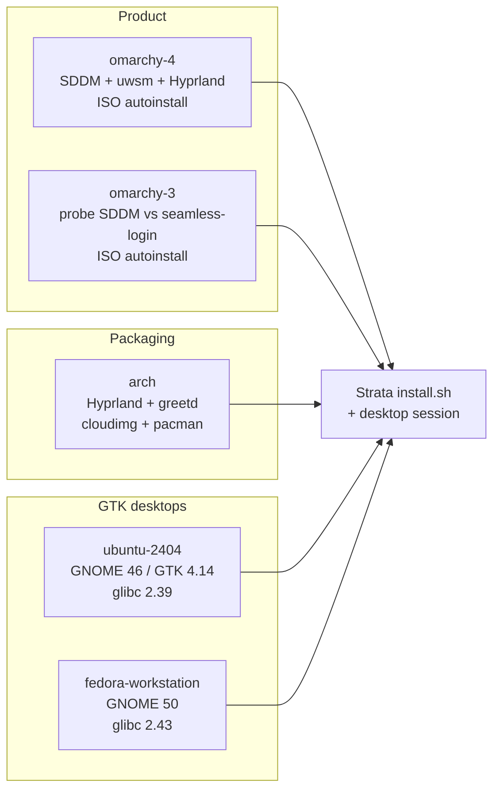
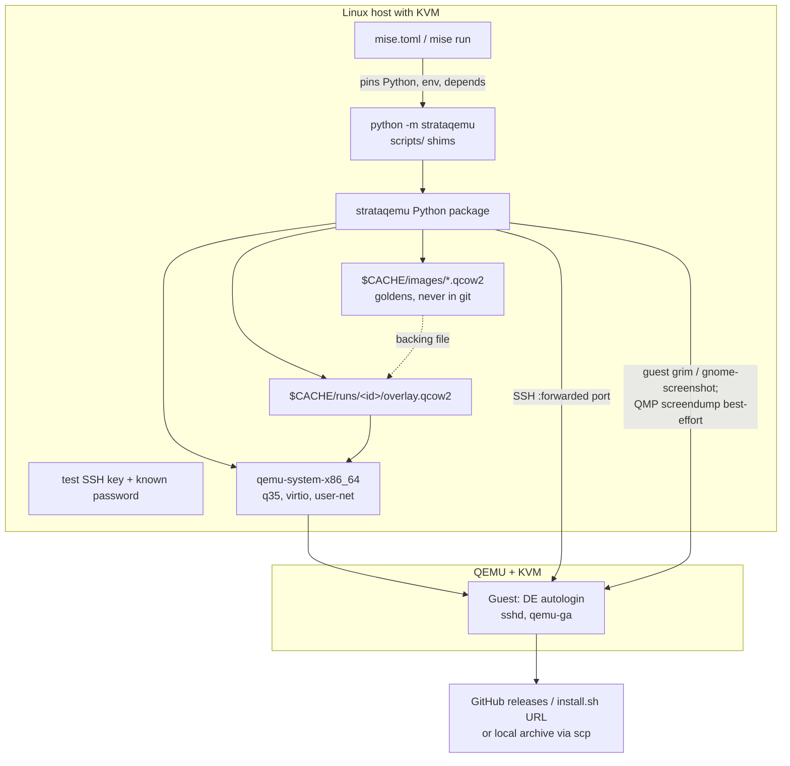
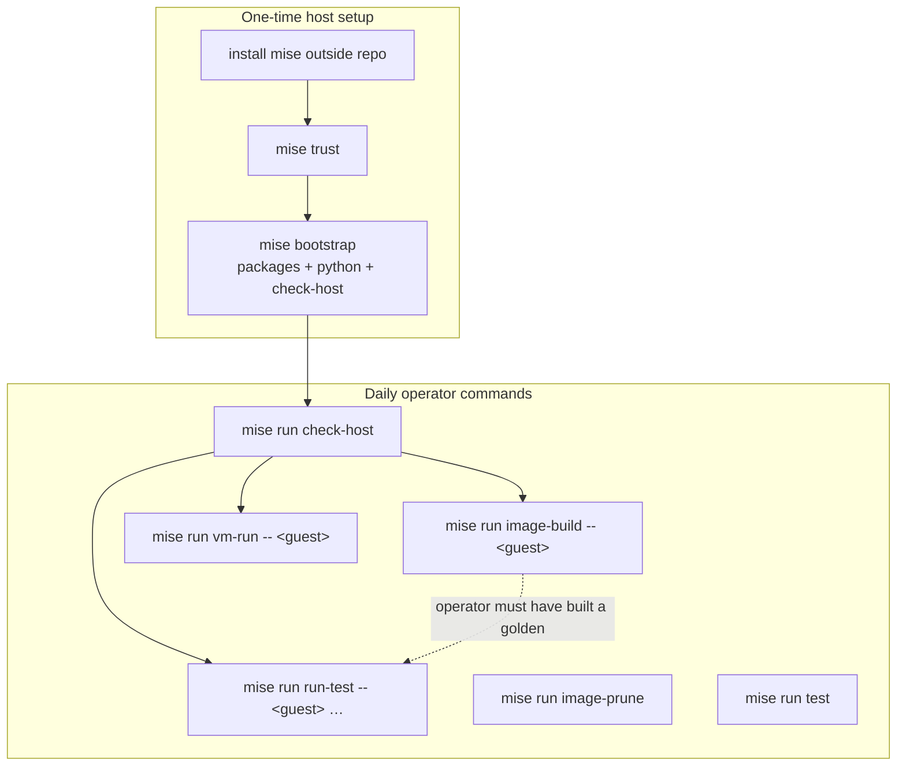
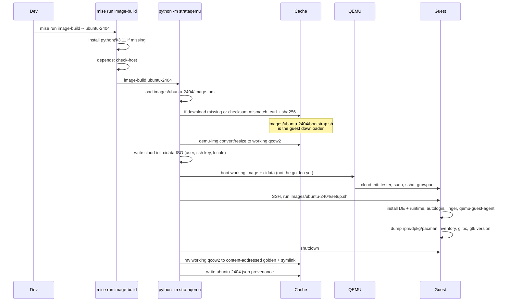
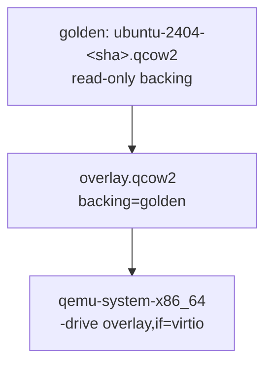

# Strata QEMU Distro Matrix

| Field | Value |
| --- | --- |
| **Title** | Reproducible QEMU guests for Strata installer and desktop-session testing |
| **Date** | 2026-09-11 |
| **Status** | Draft |
| **Repository** | `strata-qemu-testing` (`/home/wmfeht/dev/strata-qemu-testing`) |
| **Application under test** | Strata (`/home/wmfeht/dev/strata`), GTK4 file manager |

---

## Overview

Strata is a GTK4 file manager designed for Omarchy and compatible GTK4 Linux environments. Current binaries require glibc 2.39 or newer. The canonical GUI suite in the Strata tree (`tests/e2e`, `scripts/e2e.sh`) is a **pinned Ubuntu 24.04 container** with Xvfb and a private D-Bus/AT-SPI bus. That suite is the widget-and-scenario evidence; it is not a distro matrix and must remain so.

This repository is complementary and independent. It maintains a **closed matrix of five QEMU/KVM guests** in which a developer can (1) install Strata the way a user would, primarily via `install.sh`, and (2) use it in a real desktop session: compositor, autologin, session D-Bus, and a Strata window. Portal backends are installed so GTK dialogs do not misbehave; asserting FileChooser/FileManager1 is a later PR. Recipes live in git. Golden qcow2 images (and, for UEFI guests, the companion OVMF_VARS) do not. Each test run boots a disposable overlay so installer tests cannot mutate the golden disk.

**Host-side, mise is the operator-facing entry point.** A committed `mise.toml` pins Python, declares the host packages this repo can actually install, and exposes every workflow (`check-host`, `image-build`, `run-test`, `vm-run`, `image-prune`, unit tests) as `mise run …` tasks. mise does **not** replace QEMU argv, qcow2 overlays, guest `bootstrap.sh` recipes, or session oracles — those stay in the Python `strataqemu` package and Cockpit-style bash under `images/`. The split is: mise bootstraps and orchestrates the **Linux KVM host**; Python + bash build and drive the **guests**.

Open questions in this document were **resolved by the document owner on 2026-09-11** and are recorded as Key Decisions. Ubuntu/Fedora `install.sh` smokes and the version smoke **block on Strata CLI flags that do not exist yet** (`--archive PATH`, non-Arch non-interactive that trusts installed packages, `strata --version` that does not open GTK). The QEMU repo still lands images, sessions, window oracles, and Arch/Omarchy installer runs that already have flags.

The guest/VM orchestration model is not novel. It copies Cockpit bots' image-recipe / overlay / `vm-run` shape, cloud-init first-boot from official cloud images, Omarchy's own cidata ISO autoinstall, and a few operational ideas from openQA (serial logs, timeout budgets, failure screenshots) without adopting openQA as a runtime.

---

## Background & Motivation

### Current state

Strata's supported install path is documented in [`/home/wmfeht/dev/strata/README.md`](/home/wmfeht/dev/strata/README.md) and implemented in [`/home/wmfeht/dev/strata/install.sh`](/home/wmfeht/dev/strata/install.sh):

```bash
curl -fsSL https://raw.githubusercontent.com/lgse/strata/main/install.sh | bash
```

The installer detects architecture (`x86_64` / `aarch64`), glibc (`MIN_GLIBC=2.39` via `getconf GNU_LIBC_VERSION`), Arch (`ID=arch` or `ID_LIKE` containing `arch`, or an Omarchy major), and Omarchy 3 or 4 (`omarchy version`, else `/usr/share/omarchy/version` or `$HOME/.local/share/omarchy/version`). It downloads the latest **stable** GitHub release, verifies SHA-256, optionally verifies GitHub Actions provenance with `gh attestation verify` (skipped without `gh` or without `gh auth`), and installs the binary to `~/.local/bin/strata`. Optional flags (`--with-desktop-entry`, `--with-folder-association`, `--with-file-manager`, `--with-file-chooser`, `--with-omarchy-keybinds`, `--with-smb`, `--with-raw`) imply `--non-interactive`.

Non-interactive package installation is **Arch-only**. On any other distro, `--non-interactive` dies with:

> Non-interactive dependency installation currently supports Arch-based systems only.

Interactive mode on non-Arch asks whether equivalent packages are already installed. That constraint is a first-class input to this design, not something this repo papers over.

The existing E2E harness (`docs/e2e-testing.md`, `tests/e2e/Dockerfile`) pins Ubuntu 24.04 by digest, a dated `snapshot.ubuntu.com` index (`20260901T000000Z` at the time of writing), GTK 4.14, and Cairo/software rendering. It never installs Strata as a user would. It never boots GDM, SDDM, greetd, Hyprland, or a portal. It is the wrong tool for "does `install.sh` plus a real session work on Omarchy 4 / Arch / Ubuntu / Fedora".

AUR packaging (`packaging/aur/`, `docs/packaging.md`) is proposed and not yet published. Debian/Ubuntu/Fedora/Flatpak/AppImage packaging is explicitly out of current Strata packaging scope. This repo treats `install.sh` as the install method under test. AUR/`pacman -U` is deferred until `AUR_PUBLISH_ENABLED` in the Strata repo; no CLI is sketched. It does not vendor Strata sources.

On the host, a five-guest QEMU matrix also needs a declared developer environment: a Python interpreter at the version the CLI is written for, plus `qemu-system-x86_64`, `qemu-img`, `xorriso`, OpenSSH, OVMF 4M firmware, and a virgl/EGL userspace stack. Those are ordinary distro packages **when the host's package manager is one mise supports**. They are **not** something a Python package can install, and they are **not** the same as "the host is a KVM box" (kernel module, `/dev/kvm`, GPU/EGL). This repo uses mise so the installable subset is declared in git; `check-host` remains fail-closed for the rest.

### Pain points this repo addresses

- No reproducible, git-described guest that looks like Omarchy Quattro (Hyprland, uwsm, Lua bindings, `omarchy` on PATH).
- No way to run the real installer against a logged-in graphical session without using a developer's daily machine.
- The container E2E cannot see desktop entries, `inode/directory` handlers, FileManager1 activation, xdg-desktop-portal, or Omarchy keybinds.
- Distro glibc/GTK/GVfs combinations that users actually run are untested except for the one pinned Ubuntu toolkit.
- No declared host toolchain: operators otherwise hunt per-distro names for qemu/OVMF/xorriso by hand, and Python 3.11+ is "whatever is on PATH".

### What this is not

This is not a general-purpose distro QA platform, not a replacement for `scripts/e2e.sh`, and not an openQA deployment. mise is the host tool/task runner, not a guest test framework.

---

## Goals & Non-Goals

### Goals (v1)

1. Maintain a **closed matrix of five x86_64 guests** (see [Target matrix](#target-matrix)). Adding a *sixth* guest is a design change, not a config tweak.
2. Make **guest images** recipe-reproducible: URL + checksum of the source ISO/cloud image, recorded package set / generation metadata, rebuildable from scratch. Not bit-identical disks. `--install-from release` is a **live** integration of today's `main/install.sh` and `/releases/latest` (SHAs recorded); `--install-from local-archive` uses `install.sh --archive PATH` once that Strata flag exists.
3. Install Strata as a user would via `install.sh`. Arch/Omarchy v1 uses flags that already exist. Ubuntu/Fedora installer smokes **wait** on Strata `--archive PATH` and a non-Arch `--non-interactive` path that trusts already-installed packages. Do not PTY-script around missing flags as the v1 merge bar.
4. Exercise a **real desktop session**: compositor or GNOME Shell present, autologin, desktop entry, session D-Bus. Prove a Strata window appears. The version smoke **waits** on a real `strata --version` CLI that does not open GTK.
5. Keep the host graphical session out of the path. Guests own a **GL-capable** virtio-gpu (`egl-headless`); tests SSH in. Interactive `vm-run --graphical` is opt-in.
6. Destructive installer runs must not mutate golden images (qcow2 overlay / backing file).
7. Stay small: **mise as the host orchestrator** (pin Python, bootstrap host packages where the manager is supported, `mise run` for every operator workflow) + Python 3 CLI + bash guest recipes, direct QEMU+KVM, no libvirt, no image CDN in v1.

### Non-goals (v1)

- macOS or Windows hosts. (mise-on-Windows is irrelevant; this repo is Linux + KVM only.)
- aarch64 guests (Strata ships `aarch64-unknown-linux-gnu`; that is a later PR).
- Git-LFS of qcow2; committing disk images of any kind.
- Bit-identical image reproducibility.
- Unbounded distro matrix, weekly-new-spin coverage, or "every glibc 2.39+ distro".
- Replacing or wrapping Strata's container E2E.
- Vendoring Strata sources or building Strata inside guests.
- Driving the GTK widget tree, visual baselines, or mutation tests (owned by `tests/e2e`).
- Uninstall / leftover-file audit (later PR).
- FileChooser portal, SMB, RAW, folder-association, FileManager1 as **required** v1 assertions. Portal *packages* still ship in goldens so first-run GTK dialogs do not flake the window smoke.
- AUR publication testing until `AUR_PUBLISH_ENABLED` is true in the Strata repo. No `--install-from pacman-file` (or similar) is designed until then.
- CI as a merge gate or scheduled job in v1 (local developer workflow only). A later CI job, if any, would call the same `mise run` tasks; it is not designed here.
- Debian, Flatpak, AppImage, or Snap **as guests**. (Debian/Ubuntu **hosts** are supported: apt is a mise bootstrap manager.)
- Nested KVM as a supported host; KVM on the bare-metal (or properly nested) Linux host is required. mise cannot install this.
- openQA server/worker topology, libvirt, Vagrant, or NixOS. **mise is in scope** as the committed host tool/task runner; it is not a new guest-test framework and does not replace QEMU argv, overlays, or session logic.
- Shared object store / image CDN for goldens (local `$CACHE` only).
- Replacing Cockpit-style `images/<id>/bootstrap.sh` (guest ISO/cloudimg download) with `mise bootstrap`. Those names stay. See [Host bootstrap boundary](#host-bootstrap-boundary).

---

## Key Decisions

| Decision | Choice | Rationale |
| --- | --- | --- |
| Matrix size | **Exactly five guests** in v1: `omarchy-4`, `omarchy-3`, `arch`, `ubuntu-2404`, `fedora-workstation` | Product (Quattro), still-installed 3.x, packaging target, glibc-floor GTK desktop, GNOME upstream. A sixth guest is a design change. |
| Arch session | **Hyprland + greetd autologin**, not GNOME | Ubuntu and Fedora already cover GNOME. Arch-without-Omarchy plus Hyprland isolates installer/pacman behavior from Omarchy detection and from GNOME Shell. Strata is Wayland/Hyprland-first. |
| Fedora pin | **Fedora Workstation 44** (current stable as of 2026-09-11) | Released 2026-04-28, GNOME 50, glibc 2.43. Guest id stays `fedora-workstation`; the recipe pins the compose. Fedora 45 (preview, due 2026-10-20) is out of v1. |
| Ubuntu pin | **24.04 LTS**, not 26.04 | glibc 2.39 is the Strata floor. Canonical E2E is digest-pinned Ubuntu 24.04 / GTK 4.14. Ubuntu 26.04 (April 2026, GNOME 50) would silently diverge the toolkit from the widget suite. |
| Omarchy pin | **Both majors `install.sh` detects: 4 (Quattro, primary) and 3 (`omarchy-3`)** | Quattro is the product (Lua `bindings.lua`). 3.x still has users and a different keybind file (`bindings.conf`). Both are ISO autoinstall goldens. |
| Guest/VM orchestration | **Cockpit bots patterns** for *guest images and VM lifecycle*, not mkosi/openQA/libvirt | Recipes in git, artifacts out; `image-create` / overlay / `vm-run`; well-known test credentials. Desktop session is added as a first-class guest property Cockpit does not have. **mise does not own this layer.** |
| Host orchestrator | **mise** (`mise.toml` at repo root). Operator commands are `mise run <task>`. | One committed config pins Python, declares host packages, and is the task graph. Not a new test framework. See [Operator surface](#operator-surface-mise-tasks--python-cli). |
| Language | **Python 3.11+ package `strataqemu`**, pinned by mise `[tools] python = "3.11"`. Thin `scripts/` shims call `python -m strataqemu`. Host Python deps: **stdlib**. SSH via `subprocess` + OpenSSH, not paramiko. **No project venv** in v1 (nothing to install into one). | Matches Strata's `scripts/*.py` and Cockpit bots. mise supplies the interpreter; Python implements QEMU/SSH/session. `pexpect` is not the v1 Ubuntu/Fedora installer contract. |
| Host bootstrap | **`mise bootstrap`** installs `[bootstrap.packages]` (apt/dnf/pacman) + `[tools]`, then `[tasks.bootstrap]` → `check-host`. **Fail closed** in `check-host` for `/dev/kvm`, virgl/EGL, nested-virt-as-host, OVMF files. | mise can install packages *where the host manager is supported*. It cannot make a machine into a KVM+GL host. See [Host bootstrap boundary](#host-bootstrap-boundary). |
| Task graph | `run-test` **depends on `check-host` only**, never on `image-build`. Missing golden → fail with "run `mise run image-build -- <id>` first". | Same discipline as Strata `e2e.sh` not rebuilding the Ubuntu base. mise `depends` must not silently build a 40G golden. |
| Omarchy construction | **Official ISO + cidata autoinstall**; golden is **`(qcow2 + OVMF_VARS.4m.fd)`** | Omarchy's only supported install is the ISO. Limine boot entries live in NVRAM. Quattro session is **SDDM autologin → uwsm → Hyprland**. Omarchy 3: **probe** SDDM vs `omarchy-seamless-login.service`; do not assume greetd. |
| Cloud guests | **Official cloud images + cloud-init + DE in the setup script** | Closest to "what the distro ships". Cloud images have no desktop; the recipe installs one and disables first-boot wizards. |
| Hypervisor | **Direct `qemu-system-x86_64` + KVM**, not libvirt | Matches mkosi qemu, Cockpit `machine`, and Omarchy `omarchy-iso-boot`. Optional libvirt export later. |
| Overlays | **qcow2 backing file per run** (`backing_file_strict=on`, absolute backing path); golden never opened read-write by tests | Cockpit `image-customize` / `vm-run` default. Omarchy integration tests copy firmware vars per overlay the same way. |
| Display | **`-vga none -device virtio-gpu-gl-pci -display egl-headless,gl=on -vnc 127.0.0.1:…` for tests; `virtio-vga-gl` + GTK/SDL GL for `--graphical`** | GNOME Shell and Hyprland/Aquamarine need a GBM/EGL DRM device. 2D `virtio-gpu-pci` + `-display none` commonly yields a black head or no Wayland session. Default VGA must be suppressed or guests see two heads. |
| Window observation | **Primary: session-bus name `io.github.lgse.Strata` (GNOME) or `hyprctl clients` class (Hyprland). AT-SPI second. Screenshot always (guest `grim`/`gnome-screenshot`; QMP best-effort).** | Pixel needles are not the v1 oracle. QMP `screendump` often has no surface under GL. |
| Independence | **Consumes published `install.sh` URL / release archives / optional local tarball. Does not git-submodule Strata.** | This repo must still work when the Strata tree is absent. |
| Credentials | **Well-known test user `tester:foobar`. SSH key generated into `$CACHE/keys/` on first `check-host`; only `keys/README.md` is in git.** | Cockpit commits `machine/identity`. We generate locally because goldens are a per-machine cache. No production secrets. |
| App pinning | **`--install-from release` is live (`main/install.sh` + `/releases/latest`); `--install-from local-archive` is `install.sh --archive PATH` once that flag exists.** | Distro images are pinned. Record SHAs in `result.json`. |
| Ubuntu/Fedora installer | **Blocked on Strata flags**: `--archive PATH` and non-Arch `--non-interactive` that trusts already-installed packages | Owner decision 2026-09-11. Do not ship a seven-prompt PTY as the v1 merge bar. File issues on `lgse/strata`. |
| Version smoke | **Blocked on a real `strata --version` that does not open GTK** | Owner decision 2026-09-11. Installer-log parse is debug-only, not the pass criterion. File an issue on `lgse/strata`. |
| AUR / pacman | **Not designed until `AUR_PUBLISH_ENABLED`** | No `--install-from pacman-file` (or similar) CLI is sketched. |
| Object store | **Not v1. Local `$CACHE` only.** | Goldens are per-machine. |
| Ubuntu 26.04 | **Only after Strata container E2E toolkit bump; adding it is a design change** | Keep 24.04 aligned with the widget suite. |
| CI | **Local developer workflow first; no CI in v1** | Nested KVM on GitHub runners is unreliable. Future CI, if any, would invoke `mise run`. |
| SDDM session file | **Probe `/usr/share/wayland-sessions/`; prefer `omarchy.desktop` then `hyprland-uwsm.desktop`** | Quattro session file name is not stable across ISOs. |
| Reproducibility bar | **Recipe-reproducible guests, checksum-pinned sources, recorded package inventory. Live release tests are not bit-reproducible for the app. Host Python is lockfiled.** | Distro mirrors move. Snapshot strategy is per-distro and honest about limits. `mise.lock` pins the CPython build, not qemu packages (`"latest"`). |

---

## Target matrix

Five guests. A sixth is a design revision.



| Guest id | Distro | Session | glibc (expected) | GTK (expected) | Why it is in v1 | Source of golden |
| --- | --- | --- | --- | --- | --- | --- |
| `omarchy-4` | Omarchy Quattro 4.x (pinned ISO, currently 4.0.3) | **SDDM autologin → uwsm → Hyprland**. Probe `/usr/share/wayland-sessions/`; prefer `omarchy.desktop` then `hyprland-uwsm.desktop`. | Arch rolling, ≥ 2.39 | Distro GTK4 | **Primary product.** `install.sh` detects Omarchy 4, writes `~/.config/hypr/bindings.lua`. | Official ISO `https://iso.omarchy.org/omarchy-4.0.3.iso` + SHA256 `03d60bc74306dca51f96e1a84b690871d8d606826b260edd0208962da8507d14` (refresh the pin when the recipe is updated) + cidata autoinstall. Golden = qcow2 **plus** post-install `OVMF_VARS.4m.fd`. |
| `omarchy-3` | Omarchy 3.x (pinned latest 3.x ISO at implementation; testdata fixture is `Omarchy 3.8.2`) | **Probe, do not assume greetd.** 3.1+ used SDDM (keyring-on-login, theme). Pre-Quattro also shipped `omarchy-seamless-login.service`. `setup.sh` enables whichever the ISO installed. Keybinds: `~/.config/hypr/bindings.conf` (hyprlang), not Lua. | Arch rolling, ≥ 2.39 | Distro GTK4 | **Still-installed major.** `detect_omarchy_major` returns 3; installer writes `bindings.conf`. | Official 3.x ISO from `https://iso.omarchy.org/` + SHA256 sidecar + cidata. Same `(qcow2 + VARS)` golden as 4. Pin URL/SHA256 at implementation. |
| `arch` | Arch Linux (arch-boxes cloudimg, dated) | **greetd autologin → Hyprland** (committed `hyprland.lua` + greetd drop-in; **no** `omarchy`) | Rolling, ≥ 2.39 (currently ~2.42–2.44) | Distro GTK4 | **Primary packaging/installer target.** `ID=arch`, pacman path, negative Omarchy detection. | Official [arch-boxes](https://gitlab.archlinux.org/archlinux/arch-boxes) `Arch-Linux-x86_64-cloudimg-<date>.qcow2` from `https://fastly.mirror.pkgbuild.com/images/` + SHA256 sidecar |
| `ubuntu-2404` | Ubuntu 24.04 LTS | GNOME Shell + GDM autologin; gnome-initial-setup/tour **masked** | **2.39** (Noble `glibc` 2.39; exact package NVR pinned at implementation, not assumed) | **4.14** (matches E2E Dockerfile) | glibc floor, largest GTK desktop population, same toolkit generation as canonical E2E | `https://cloud-images.ubuntu.com/noble/<date>/noble-server-cloudimg-amd64.img` + SHA256, then `ubuntu-desktop-minimal` |
| `fedora-workstation` | Fedora 44 Workstation | GNOME 50 + GDM autologin (Wayland-only GDM); initial-setup **masked** | **2.43** | GTK 4.x from F44 | GNOME upstream; `gvfs` package name as in Strata README | Cockpit-style scrape of `https://download.fedoraproject.org/pub/fedora/linux/releases/44/Cloud/x86_64/images/` for `Fedora-Cloud-Base-Generic-*.qcow2` + signed CHECKSUM. Do not hard-code compose `44-1.7`; pin the SHA256 the bootstrap actually fetched. Then Workstation GNOME. |

Guest ids contain no `.` and no file extension, matching Cockpit's image-name rule (`ubuntu-2404`, not `ubuntu-24.04`).

### Explicitly rejected (v1)

| Candidate | Why rejected |
| --- | --- |
| Ubuntu 22.04 | glibc 2.35. `install.sh` must refuse. Not a support target. |
| Ubuntu 26.04 LTS | Newer GNOME/GTK than the canonical E2E pin. Only after Strata container E2E toolkit bump; adding it is a design change. |
| Debian 12 / 13 | Not a product target; packaging out of scope; Debian 12 glibc is below 2.39. |
| Fedora 43 | Previous stable (EOL 2026-12-09). Current is 44. |
| openSUSE, Mint, Pop!_OS, immutable spins (Silverblue, SteamOS) | Unbounded matrix. Immutable/ostree needs a different install model. |
| aarch64 of any guest | Host is x86_64 KVM first. Strata ships ARM64 archives; that is a later PR. |
| GNOME on Arch | Ubuntu and Fedora already cover GNOME. Arch-without-Omarchy plus Hyprland is the more informative split. |
| Full Ubuntu Desktop ISO install | Cloud image + `ubuntu-desktop-minimal` is faster and cloud-init-native. The Desktop ISO has no cloud-init by default. |

### How the matrix maps onto `install.sh`

Verified from [`install.sh`](/home/wmfeht/dev/strata/install.sh):

| Guest | `detect_target` | glibc gate | `distro_id` / Omarchy | Package path | `--non-interactive` today |
| --- | --- | --- | --- | --- | --- |
| `omarchy-4` | `x86_64-unknown-linux-gnu` | pass | Omarchy major 4, pacman | `install_arch_dependencies` | **supported** |
| `omarchy-3` | same | pass | Omarchy major 3, pacman | same | **supported** |
| `arch` | same | pass | `ID=arch`, Omarchy **not** detected | same | **supported** |
| `ubuntu-2404` | same | pass (2.39) | non-Arch | prints package list, asks | **dies** until Strata grows a non-Arch non-interactive path |
| `fedora-workstation` | same | pass (2.43) | non-Arch | same | **dies** same way |

v1 therefore:

- On `omarchy-4`, `omarchy-3`, and `arch`: run `install.sh --non-interactive --with-desktop-entry --without-file-chooser` (flags already exist). `--without-file-chooser` is required for a clean main window (`take_prompt_offer`).
- On `ubuntu-2404` and `fedora-workstation`: **golden recipes and session/window smokes land first.** `install.sh` runs wait on Strata `--archive PATH` (for local archives) and a non-Arch `--non-interactive` that trusts already-installed packages (plus `--with-desktop-entry --without-file-chooser`). See [Installer contract](#installer-contract).

---

## Prior art (studied and cited)

This section is the source of the synthesis. Patterns are adopted or rejected by name.

### 1. cockpit-project/bots — **primary analogue for guests/VMs (adopted)**

Sources: [Cockpit Bots README](https://cockpit-project.org/external/bots/README), [HACKING.md](https://github.com/cockpit-project/bots/blob/main/HACKING.md), [`images/scripts/fedora-44.bootstrap`](https://github.com/cockpit-project/bots/blob/main/images/scripts/fedora-44.bootstrap), [`machine/make-cloud-init-iso`](https://github.com/cockpit-project/bots/blob/main/machine/make-cloud-init-iso), [`image-customize`](https://github.com/cockpit-project/bots/blob/main/image-customize).

What they do:

- Limited, named OS image set (`fedora-44`, `ubuntu-2404`, `arch`, …). Names have no `.` and no extension.
- `image-create` builds from a `.bootstrap` script that usually downloads a cloud image (`fedora-44.bootstrap` curls `Fedora-Cloud-Base-Generic*.qcow2` from the F44 Cloud images directory, then calls `lib/cloudimage.bootstrap`).
- `.setup` runs **inside** the booted image to install test dependencies and create `admin`.
- Images are **not committed**. Cache default `~/.cache/cockpit-images/`. Git stores a symlink/name; the qcow2 is content-addressed.
- `image-customize` keeps the original intact and writes an overlay under `test/images/`.
- `vm-run` boots an **ephemeral overlay** by default; `--maintain` writes the persistent overlay.
- Direct QEMU, SSH, serial console. Cloud-init ISO with well-known `admin:foobar` / `root:foobar` and a test SSH key.
- `TEST_OS` selects the guest.

**Adopted:** recipe scripts in git; artifacts out of git; content-addressed qcow2 + convenience symlink; overlay-per-run; `image-build` / `vm-run` / `run-test` CLI shape; cloud-init for SSH/user; well-known test password; direct QEMU; guest id naming. **Keep per-guest `bootstrap.sh` names.**

**Adapted, not copied:** Cockpit images are **headless servers** for a web console. Desktop/GUI is not their concern. Every guest in this repo declares a compositor/DE, how the session is started, and how the test driver observes a window.

**Rejected from Cockpit:** GitHub-watching bots, S3 image stores, `image-upload` to a fleet, the `machine` Python API as a dependency (we reimplement a *small* subset: boot, SSH, upload, command). We will not vendor `cockpit-project/bots`.

### 2. systemd/mkosi — **rejected as the v1 image builder**

Sources: [mkosi README](https://github.com/systemd/mkosi/blob/main/README.md), [mkosi(1)](https://github.com/systemd/mkosi/blob/main/mkosi/resources/man/mkosi.1.md).

Declarative recipes for Fedora/Debian/Ubuntu/Arch; `mkosi qemu` is a good QEMU launcher. Excellent from-scratch reproducibility.

**Rejected as the Omarchy path:** Omarchy's only supported install is its ISO ([omarchy-iso README](https://raw.githubusercontent.com/omacom-io/omarchy-iso/master/README.md): "The Omarchy ISO is the only supported way to install Omarchy"). mkosi cannot produce "Omarchy as a user installed it".

**Rejected as the cloud-guest path in v1:** official cloud images plus a setup script are closer to "what the distro ships" and match Cockpit. mkosi remains a **later alternative** if cloud images rot or we need from-scratch Arch without arch-boxes.

**Adopted idea:** `mkosi qemu` as evidence that a small project can drive QEMU without libvirt.

### 3. virt-builder / libguestfs — **rejected as the image source**

Templates are fast and signed, but they **trail current Fedora** (builder.libguestfs.org has fedora-43; **no fedora-44** at design time; man-page examples still show 41/42). They are **server-oriented** and have no Omarchy template. Customizing a template into a GNOME/Hyprland session is not simpler than cloud-init + setup script.

**Adopted idea:** `--size` grow of a small cloud image before installing a DE.

### 4. Official cloud images + cloud-init — **adopted for Arch, Ubuntu, Fedora**

- Ubuntu: [cloud-images.ubuntu.com](https://cloud-images.ubuntu.com/) + [cloud-localds / QEMU howto](https://cloudinit.readthedocs.io/en/latest/howto/launch_qemu.html). Server cloud image has no GNOME; recipe installs `ubuntu-desktop-minimal`.
- Fedora: `Fedora-Cloud-Base-Generic-*.qcow2` (same source Cockpit's `fedora-44.bootstrap` uses). Recipe installs Workstation GNOME.
- Arch: official [arch-boxes cloudimg](https://gitlab.archlinux.org/archlinux/arch-boxes), fortnightly, SHA256 + GPG, cloud-init preinstalled. Basic image (`arch:arch`) is a local-use alternative; we use **cloudimg** so first-boot is cloud-init like the others.

**Gap:** none of these ship a desktop. The setup script must install the DE, enable graphical.target, configure autologin, enable systemd user lingering, and install Strata **runtime** packages (not Strata itself).

### 5. openQA / os-autoinst — **rejected as the runtime; ideas stolen**

Sources: [openQA GettingStarted](https://github.com/os-autoinst/openQA/blob/master/docs/GettingStarted.md), [GNOME openQA tests](https://gitlab.gnome.org/GNOME/openqa-tests).

Powerful: full installer, needle-based desktop, distributed workers. Operational surface (web UI, scheduler, workers, needle repos) is far too large for a five-guest app-test matrix.

**Stolen, without the topology:**

- Timeout budgets per phase (boot, install, session, window).
- Serial console captured to an artifact.
- Failure screenshot (in-guest `grim` / `gnome-screenshot` primary; QMP `screendump` best-effort under GL; not needles).
- Condition-based waits, not `sleep` (same rule as Strata `tests/e2e`).

GNOME's openQA tests cover Shell and core apps in a VM; they still do not help us install a third-party GTK app via `install.sh`. We will not add a needle directory in v1.

### 6. Omarchy ISO project — **adopted for `omarchy-4`**

Source: [omacom-io/omarchy-iso README](https://raw.githubusercontent.com/omacom-io/omarchy-iso/master/README.md).

This is the closest prior art for the product guest:

- ISO is the only supported install.
- **Autoinstall:** second drive labeled `cidata` (cloud-init NoCloud volume id) with `user_configuration.json` + `user_credentials.json` (+ optional `authorized_keys`). Skips the configurator.
- Password hash via `openssl passwd -6`.
- `authorized_keys` enables sshd and `ufw allow ssh` (stock Omarchy has sshd disabled).
- Their own QEMU tests: `omarchy-iso-boot`, `omarchy-iso-test` (QMP screendump + OCR + keystrokes), `test/integration` (**install once, then throwaway overlay + copy of firmware vars per scenario**).

**Adopted:** cidata autoinstall, unencrypted disk for unattended first boot (encrypted autoinstall still prompts for LUKS — we will **not** encrypt v1 goldens), overlay-per-run **plus a copy of post-install firmware vars**, QMP/`grim` screenshots, OVMF **4M non-secboot** (`OVMF_CODE.4m.fd` + `OVMF_VARS.4m.fd`; Proxmox example uses `efitype=4m,pre-enrolled-keys=0`). `omarchy-iso-boot` argv (`q35`, virtio-blk `bootindex=1`, ISO `bootindex=2`, 8 GiB RAM, 40G disk, `virtio-vga-gl`) is the template we adapt for tests (`egl-headless` instead of `sdl,gl=on`).

**Rejected:** OCR-driving the interactive configurator (autoinstall is enough); their in-guest acceptance suite (that tests Omarchy, not Strata); wrapping `omarchy-iso-boot` as the runtime (see [Alternative F](#alternative-f--wrap-omarchy-isos-qemu-harness)).

### 7. Sibling: Flea (`/home/wmfeht/dev/flea`) — **comparison only**

Flea is another Omarchy-native file manager (Quickshell, AUR, `flea --default` writes `inode/directory` and the same Super+Shift+F / Super+Alt+Shift+F overrides into `~/.config/hypr/bindings.lua` between marker comments). Useful later when this repo tests `--with-omarchy-keybinds` and default-handler behavior. **Not the app under test.** Do not install Flea in goldens.

### 8. Strata container E2E — **complementary, not duplicated**

[`docs/e2e-testing.md`](/home/wmfeht/dev/strata/docs/e2e-testing.md), [`tests/e2e/Dockerfile`](/home/wmfeht/dev/strata/tests/e2e/Dockerfile), [`scripts/e2e.sh`](/home/wmfeht/dev/strata/scripts/e2e.sh).

Pinned Ubuntu 24.04 `@sha256:1e0a86e57d247923571b75e0aaf48a1449cf8c543d51fb3e07a4a7d7bfa79316`, snapshot APT, Xvfb, private buses, AT-SPI by accessible role (never pixels except the small visual-baseline set). **This QEMU repo must not grow a copy of that suite.** Window-appeared is a smoke, not a scenario runner.

### 9. mise — **adopted for the host only**

Sources: [mise](https://mise.jdx.dev/), [getting started](https://mise.jdx.dev/getting-started.html), [tasks](https://mise.jdx.dev/tasks/), [running tasks](https://mise.jdx.dev/tasks/running-tasks.html), [bootstrap](https://mise.jdx.dev/bootstrap.html), [`mise bootstrap` CLI](https://mise.jdx.dev/cli/bootstrap.html), [bootstrap packages](https://mise.jdx.dev/bootstrap/packages/), [Python](https://mise.jdx.dev/lang/python.html), [lockfile](https://mise.jdx.dev/dev-tools/mise-lock.html).

What it does (APIs this repo will actually use; do not invent others):

- `[tools]` pins versioned developer tools (here: CPython). `mise install` / `mise run` install missing tools before a task.
- `[tasks.<name>]` in `mise.toml` (and optional file tasks in `mise-tasks/`). `mise run <task>`. `depends` for prerequisites. Extra argv is forwarded to the task command when no `usage` spec is declared.
- `[bootstrap.packages]` keyed `"manager:package"` (`apt:`, `dnf:`, `pacman:`, …). Entries for a manager that is not available on this machine are skipped. `"latest"` accepts an already-installed version and does not upgrade on every apply.
- `mise bootstrap` is **machine setup beyond `[tools]`**: packages, then `mise install`, then a task named `bootstrap` if one exists. `--dry-run` / `mise bootstrap plan` preview. `--yes` skips confirmation. Never installs system packages implicitly on `mise run`.
- `mise trust` is required for config that can execute (tasks, some env directives).
- `mise.lock` records resolved tool versions + artifact checksums.

**Adopted:** committed `mise.toml` + `mise.lock`; Python pin; host package declarations for apt/dnf/pacman; `mise run` as the operator CLI; `[tasks.bootstrap]` as post-package `check-host`; `mise trust` in the first-run docs.

**Rejected as a guest/VM layer:** mise does not speak QEMU, qcow2 backing files, OVMF vars, cloud-init, or Hyprland session targeting. Guest `images/<id>/bootstrap.sh` stays a Cockpit-style downloader, not a mise task that pretends to be `mise bootstrap`.

---

## Proposed Design

### System context



### Host bootstrap boundary

Two different words named "bootstrap" must not be conflated:

| Name | What it is | What it is not |
| --- | --- | --- |
| **`mise bootstrap`** | Host-machine setup: `[bootstrap.packages]` + `[tools]` + `[tasks.bootstrap]` → `check-host` | Not a guest image build. Does not download Omarchy ISOs or cloudimgs. |
| **`images/<id>/bootstrap.sh`** | Cockpit-style **guest recipe**: download the pinned ISO/cloud image, verify sha256, leave the blob in `$CACHE/downloads/` | Not host package install. Keep this filename. |
| **`mise install`** | Install `[tools]` (Python 3.11) | Does not install qemu/OVMF. mise never installs system packages implicitly. |
| **`mise run check-host`** | Fail-closed **capability** check | Does not `apt-get install`. If qemu is missing, it fails and points at `mise bootstrap`. |

**What mise can typically pin or install**

| Item | Mechanism | Notes |
| --- | --- | --- |
| CPython 3.11.x | `[tools] python = "3.11"` + `mise.lock` | Isolated under mise's data dir. Not the distro `python3`. |
| `qemu-system-x86_64`, `qemu-img` | `[bootstrap.packages]` `apt:` / `dnf:` / `pacman:` | Only if that manager is available. `"latest"`; not a qemu version pin. |
| `xorriso` | same | cidata ISO volume id `cidata`. |
| OpenSSH client | same | `ssh` / `scp`; not paramiko. |
| OVMF 4M firmware packages | same | Files still discovered by `check-host` search order. |
| virglrenderer + EGL/Mesa userspace | same | Libraries, not "this GPU can do EGL". |
| QEMU GL **modules** matching the frozen argv | same | Arch/Fedora split `qemu-ui-egl-headless` + `virtio-gpu-gl-pci` device RPMs/pkgs; Ubuntu `qemu-system-gui`. Not pulled by `qemu-system-x86` alone. |
| QEMU GTK/SDL UI modules | same | Needed for `vm-run --graphical`. |
| `curl` + CA certs | same | Guest `bootstrap.sh` downloaders. |

**What mise cannot install** (stay fail-closed in `check-host`)

- KVM kernel module, `/dev/kvm` node, or membership in the `kvm` group.
- A working virgl/EGL stack on a given GPU/driver (userspace `.so` is necessary, not sufficient).
- Nested virtualization as a supported host.
- "This machine is a Linux KVM box" in general.
- Guest golden qcow2 images.

**Unsupported host package manager.** mise's built-in managers for this repo are **apt, dnf, and pacman**. If the host is something else (Gentoo, NixOS — the latter is a non-goal — Alpine apk, …):

1. `mise bootstrap` **apply skips** unavailable managers and can still exit 0 at the packages phase with nothing installed. That is not a capability success.
2. `mise bootstrap packages status` and `mise bootstrap plan --detailed-exitcode` still *list* those `apt:`/`dnf:`/`pacman:` entries as unavailable/unknown (unknown is a non-success for `plan --detailed-exitcode`). Use them to see the skip; do not treat apply-0 as “packages are present.”
3. The operator installs qemu (including GL modules), qemu-img, xorriso, OpenSSH client, OVMF 4M, virglrenderer, curl via whatever the host uses.
4. `mise install` still provides Python.
5. **`mise run check-host` is the fail-closed gate** if binaries, `/dev/kvm`, virgl/egl, `curl`, or OVMF 4M are missing.

Do not declare `nix:` or `brew:` qemu as a v1 fallback. Do not add `[bootstrap.users]` to shove the operator into `kvm` — that is one-time OS setup and often needs a re-login; `check-host` tests `os.access("/dev/kvm", os.R_OK|os.W_OK)` and fails with the `kvm` group hint.

**mise itself** is installed **once, outside this repo** (distro package — Arch `pacman -S mise`, Fedora COPR, Debian/Ubuntu extrepo/PPA — or the upstream installer after reviewing it). This repo does not `curl | sh` mise from a task. Require a mise that implements `[bootstrap.packages]`, `mise bootstrap`, and TOML `[tasks]` (`mise bootstrap --help` must exist). Set `min_version` in `mise.toml` at implementation by bumping until that help text exists on Arch, Ubuntu, and Fedora hosts. **Do not copy Strata’s `min_version = "2026.9.0"`** — that floor is tools+tasks only; `[bootstrap.packages]` is newer.

### Operator surface: mise tasks + Python CLI

**Concrete shape (this is the decision, not an open question):**

1. **`mise.toml` is the operator contract.** Documented commands are `mise run <task>`. After PR 1, READMEs and later PRs cite those, not `./scripts/…` as the primary path.
2. **Python remains the implementation.** Every host workflow is `python -m strataqemu <subcommand> …` with argparse. Unit tests import the package.
3. **Thin `scripts/` shims stay** as `#!/usr/bin/env python3` (or a one-line exec of `-m strataqemu`) so the module is invocable without typing `-m`, and so a file task can call them if a script grows. **Scripts do not call `mise run`.** That would be a cycle. After `mise install` / `mise run`, the pinned CPython is on PATH for tasks; a raw `./scripts/check-host` outside mise is unsupported (may hit distro Python < 3.11).
4. **TOML tasks, not `mise-tasks/` file tasks, in v1.** Each task is a one-liner wrapping the Python CLI. Set `raw_args = true` on every argparse-proxy task so `mise run run-test --help` reaches Python, not mise’s task help. No `usage` spec — argparse owns `--force`, `--session-only`, guest ids. Move a task to `mise-tasks/` only if it outgrows a one-liner.
5. **TTY for QEMU children.** `image-build`, `run-test`, `vm-run`, and `spike-wayland-ubuntu` set `interactive = true` so stdin/Ctrl-C attach to the QEMU process group. `depends = ["check-host"]` still runs first; the interactive task then takes the TTY. Operators can also pass `mise run --raw …`. Graphical `vm-run` should use `MISE_TASK_OUTPUT=interleave` (or the task-level equivalent) so mise does not prefix GTK/SDL output.

Justification: mise owns interpreter pin, host packages, env, and the task graph. Python owns QEMU argv, overlays, SSH, session targeting, oracles. Cockpit-style `scripts/` remain an implementation detail, not the documented UX. Operators who already have Python 3.11+ and host qemu can still `mise exec -- python -m strataqemu …`; they are not a supported first-run path.

### `mise.toml` sketch (committed at repo root)

Values are the v1 contract. Package names are the current Arch / Debian-Ubuntu / Fedora mappings that match the **frozen argv** (`-device virtio-gpu-gl-pci -display egl-headless,gl=on` and `--graphical` `virtio-vga-gl`). `os` filters are omitted: unavailable managers are skipped anyway. `check-host` still fail-closes if a module `.so` is missing after a distro split.

```toml
min_version = "REPLACE_WITH_BOOTSTRAP_FLOOR"  # bump until `mise bootstrap --help` exists on Arch/Ubuntu/Fedora. Not Strata's 2026.9.0.

[settings]
lockfile = true            # commit mise.lock; pins CPython, not qemu

[tools]
python = "3.11"

[env]
# Operator may override. Default is applied in strataqemu.config, not here, so
# a raw python -m invocation and mise run share one code path.
# STRATA_QEMU_CACHE = "/var/tmp/strata-qemu"

# ---------------------------------------------------------------------------
# Host packages. Keys are "manager:package". Only the manager present on this
# machine is applied. "latest" accepts an already-installed version.
# Does not install KVM, /dev/kvm, or a working GPU EGL stack.
# ---------------------------------------------------------------------------
[bootstrap.packages]
# QEMU system emulator (qemu-system-x86_64)
"pacman:qemu-system-x86" = "latest"
"apt:qemu-system-x86" = "latest"
"dnf:qemu-system-x86" = "latest"

# qemu-img
"pacman:qemu-img" = "latest"
"apt:qemu-utils" = "latest"
"dnf:qemu-img" = "latest"

# GL modules matching frozen argv. qemu-system-x86 does NOT pull these on
# Arch/Fedora. Ubuntu qemu-system-gui → qemu-system-modules-opengl does
# (ui-egl-headless.so + hw-display-virtio-gpu-pci-gl.so).
# Arch: virtio-gpu-gl (no -pci) is the wrong .so; we need virtio-gpu-gl-pci.
# Coarser Arch alternative (not the contract): pacman:qemu-desktop.
"pacman:qemu-hw-display-virtio-gpu-pci-gl" = "latest"  # -device virtio-gpu-gl-pci
"pacman:qemu-hw-display-virtio-vga-gl" = "latest"      # --graphical virtio-vga-gl
"pacman:qemu-ui-egl-headless" = "latest"               # depends on qemu-ui-opengl
"pacman:qemu-ui-opengl" = "latest"
"pacman:qemu-ui-gtk" = "latest"
"pacman:qemu-ui-sdl" = "latest"
"apt:qemu-system-gui" = "latest"
"dnf:qemu-device-display-virtio-gpu-pci-gl" = "latest" # hw-display-virtio-gpu-pci-gl.so
"dnf:qemu-device-display-virtio-vga-gl" = "latest"     # --graphical
"dnf:qemu-ui-egl-headless" = "latest"                  # depends on qemu-ui-opengl
"dnf:qemu-ui-opengl" = "latest"
"dnf:qemu-ui-gtk" = "latest"
"dnf:qemu-ui-sdl" = "latest"

# virgl / EGL userspace (necessary, not sufficient)
"pacman:virglrenderer" = "latest"
"pacman:mesa" = "latest"
"apt:libvirglrenderer1" = "latest"
"apt:libegl1" = "latest"
"apt:libgl1-mesa-dri" = "latest"
"dnf:virglrenderer" = "latest"
"dnf:mesa-libEGL" = "latest"
"dnf:mesa-dri-drivers" = "latest"

# OVMF 4M firmware (check-host still searches paths and fail-closes)
"pacman:edk2-ovmf" = "latest"
"apt:ovmf" = "latest"
"dnf:edk2-ovmf" = "latest"

# cidata ISO
"pacman:xorriso" = "latest"
"apt:xorriso" = "latest"
"dnf:xorriso" = "latest"

# SSH client (subprocess OpenSSH)
"pacman:openssh" = "latest"
"apt:openssh-client" = "latest"
"dnf:openssh-clients" = "latest"

# guest bootstrap.sh downloaders
"pacman:curl" = "latest"
"pacman:ca-certificates" = "latest"
"apt:curl" = "latest"
"apt:ca-certificates" = "latest"
"dnf:curl" = "latest"
"dnf:ca-certificates" = "latest"

# openssl passwd -6 for Omarchy user_credentials.json
"pacman:openssl" = "latest"
"apt:openssl" = "latest"
"dnf:openssl" = "latest"

# ---------------------------------------------------------------------------
# Tasks. Extra argv is forwarded to python -m strataqemu (raw_args = true).
# depends MUST NOT make run-test build a golden.
# interactive = true on anything that spawns QEMU (TTY / Ctrl-C).
# ---------------------------------------------------------------------------
[tasks.check-host]
description = "Fail-closed host check: /dev/kvm, qemu, virgl/egl, OVMF 4M, xorriso, ssh, curl"
raw_args = true
run = "python -m strataqemu check-host"

[tasks.bootstrap]
description = "Post-package host verification. NOT images/*/bootstrap.sh."
depends = ["check-host"]

[tasks.image-build]
description = "Build or refresh a golden from its recipe. Incremental; --force rebuilds."
depends = ["check-host"]
interactive = true
raw_args = true
run = "python -m strataqemu image-build"

[tasks.run-test]
description = "Boot overlay, run smokes. Fails if no golden — never builds one."
depends = ["check-host"]
interactive = true
raw_args = true
run = "python -m strataqemu run-test"

[tasks.vm-run]
description = "Interactive throwaway overlay. --graphical for GTK/SDL GL."
depends = ["check-host"]
interactive = true
raw_args = true
run = "python -m strataqemu vm-run"

[tasks.image-prune]
description = "Drop overlays and old run dirs. Never deletes goldens unless --images."
raw_args = true
run = "python -m strataqemu image-prune"

[tasks.test]
description = "Host-side unit tests. No KVM, no qemu, no check-host. -t . so import strataqemu works without pip install -e."
run = "python -m unittest discover -s tests -t . -v"

# PR 3 adds the run implementation. Hidden: not a daily v1 command.
# PR 1 may omit this table or stub run = "python -c 'raise SystemExit(2)'".
[tasks.spike-wayland-ubuntu]
description = "Throwaway Noble overlay: Type=wayland + guest screenshot. Operator-gated."
depends = ["check-host"]
hide = true
interactive = true
raw_args = true
run = "python -m strataqemu spike-wayland-ubuntu"
```

PR 1 commits this file **minus** a working `[tasks.spike-wayland-ubuntu]` (omit or stub). PR 3 fills that hidden task. Daily v1 commands stay `check-host` / `image-build` / `run-test` / `vm-run` / `image-prune` / `test`.

Task graph:



`image-build` → `run-test` is **operator sequencing**, not a mise `depends` edge. `mise run run-test -- ubuntu-2404` with no golden exits non-zero with an explicit message. `tasks.test` has no `depends` on `check-host`.

No `default` task that builds images or boots VMs. `mise run` with no name uses mise's task selector.

### First-run host workflow

```bash
# 0. Linux x86_64 host with KVM. macOS/Windows are non-goals.
# 1. Install mise once (outside this repo). Prefer the distro package;
#    if using https://mise.run, review the script before piping to sh.
mise --version
mise bootstrap --help    # must exist

# 2. Clone, review mise.toml (it is executable config), then:
cd strata-qemu-testing
mise trust
mise install             # Python 3.11 from [tools] / mise.lock

# 3. Host packages. Preview first. --yes is unattended (still may sudo).
mise bootstrap --dry-run
mise bootstrap           # packages + tools + tasks.bootstrap → check-host

# If the package manager is not apt/dnf/pacman, install qemu (incl. GL modules),
# ovmf, xorriso, ssh, curl yourself, then:
mise run check-host      # fail-closed; generates $CACHE/keys/ if missing
```

Daily:

```bash
mise run image-build -- ubuntu-2404
mise run run-test -- ubuntu-2404 --session-only
mise run run-test -- arch --install-from release
mise run vm-run -- arch --graphical
mise run image-prune
mise run test            # host unit tests; no KVM
```

`mise run` installs missing `[tools]` before the task. It does **not** apply `[bootstrap.packages]`. After a fresh OS, `mise bootstrap` (or `mise bootstrap packages apply`) is required once; `check-host` then fails if qemu disappeared.

### Repository layout (this repo will grow)

Greenfield. Current tree is `README.md` + `docs/design.md`. Target layout:

```
strata-qemu-testing/
  README.md                          # first-run: mise trust / install / bootstrap; points at docs/design.md
  docs/
    design.md                        # this document
  mise.toml                          # tools, bootstrap.packages, task graph (operator contract)
  mise.lock                          # committed; resolved CPython + checksums
  pyproject.toml                     # package strataqemu, python >= 3.11
  .gitignore                         # cache/, .venv/, overlays, keys private, mise.local.toml
  strataqemu/
    __init__.py
    __main__.py                      # python -m strataqemu
    cli.py                           # argparse: check-host, image-build, run-test, vm-run, image-prune
    config.py                        # paths, cache dir, guest registry
    guest.py                         # Guest dataclass loaded from images/<id>/image.toml
    qemu.py                          # argv builder, process lifecycle, QMP
    overlay.py                       # qemu-img create -b, prune
    ssh.py                           # subprocess OpenSSH, port wait, ssh -t for PTYs
    cloudinit.py                     # write user-data/meta-data, xorriso cidata ISO
    session.py                       # pick graphical loginctl session; export WAYLAND/DBUS/HYPR
    artifacts.py                     # serial log, qemu log, screenshots, junit-ish JSON
    tests_spec.py                    # v1 smoke steps as functions
    ports.py                         # bind 127.0.0.1 ephemeral SSH/VNC ports with retry
  scripts/
    image-build                      # thin shim: python -m strataqemu image-build
    run-test                         # not the documented entry; mise tasks call -m
    vm-run
    image-prune
    check-host                       # KVM, qemu, virgl/egl, OVMF 4M files (fail closed for UEFI)
  images/
    omarchy-4/
      image.toml
      bootstrap.sh                   # download ISO, verify sha256  (GUEST recipe; not mise bootstrap)
      setup.sh                       # SDDM autologin, linger, NOPASSWD, grim if missing
      cidata/
        user_configuration.json      # reviewed archinstall dump; disk=/dev/vda; no encryption
        user_credentials.json.tmpl   # password hash + tester
        user_encrypt_installation.txt  # contents: false
        authorized_keys.tmpl         # filled with test pubkey at build time
    omarchy-3/
      image.toml                     # pin 3.x ISO URL+SHA256
      bootstrap.sh
      setup.sh                       # probe SDDM vs omarchy-seamless-login; grim
      cidata/                        # same shape as omarchy-4; /dev/vda; no LUKS
    arch/
      image.toml
      bootstrap.sh                   # download arch-boxes cloudimg
      setup.sh                       # greetd + Hyprland + portals + jq + grim
      greetd-config.toml
      hyprland.lua                   # lua-first (Hyprland ≥ 0.55); syntax pinned to the dated archive
      user-data.yaml.tmpl
    ubuntu-2404/
      image.toml
      bootstrap.sh
      setup.sh                       # desktop-minimal, gnome-screenshot, mask gnome-initial-setup/tour
      user-data.yaml.tmpl
    fedora-workstation/
      image.toml
      bootstrap.sh
      setup.sh                       # GNOME, gnome-screenshot, SELinux/firewalld SSH, mask wizards
      user-data.yaml.tmpl
    common/
      install-arch.sh                # --non-interactive --with-desktop-entry --without-file-chooser
      # Ubuntu/Fedora install helper lands when Strata ships --archive + non-Arch non-interactive
  guest-tests/                       # five named smokes only; no pytest AT-SPI walker
    smoke-session.sh
    smoke-install.sh
    smoke-desktop.sh
  keys/
    README.md                        # generate into $CACHE/keys/; nothing else committed
  tests/                             # host-side unit tests, no KVM required
    test_cli.py
    test_overlay.py
    test_guest_toml.py
    test_cloudinit.py
    test_session_loginctl.py         # parse tty+wayland sample output
    test_qemu_argv.py
```

Cache (not in git), default `$XDG_CACHE_HOME/strata-qemu-testing` (override `STRATA_QEMU_CACHE`):

```
images/
  ubuntu-2404-<recipe-and-source-sha>.qcow2
  ubuntu-2404.qcow2 -> ubuntu-2404-<sha>.qcow2
  ubuntu-2404.json                   # provenance
  omarchy-4-<sha>.qcow2
  omarchy-4.vars.fd                  # post-install OVMF_VARS; copied per run
  omarchy-4.json
keys/                                # generated SSH keypair; not in git
downloads/
  noble-server-cloudimg-amd64.img
  omarchy-4.0.3.iso
runs/
  <timestamp>-ubuntu-2404/
    overlay.qcow2
    serial.log
    qemu.log
    ssh_port
    screendump-*.png
    result.json
```

Cockpit equivalent: `~/.cache/cockpit-images/` for goldens, `test/images/` for overlays. We collapse both under one cache root so the checkout stays clean.

`.gitignore` also excludes `mise.local.toml`, `mise.local.lock`, `.venv/` (unsupported in v1, but operators will create one by habit).

### Guest descriptor (`image.toml`)

Each guest is a directory under `images/` with a TOML file. Example for Ubuntu (values illustrative; pins live in the file, not this doc, when implemented):

```toml
id = "ubuntu-2404"
arch = "x86_64"
firmware = "uefi"          # "bios" for arch-boxes if the cloudimg is BIOS-only
source_kind = "cloud-image"
source_url = "https://cloud-images.ubuntu.com/noble/20260901/noble-server-cloudimg-amd64.img"
source_sha256 = "PINNED_AT_IMPLEMENTATION"
disk_gb = 40
memory_mib = 8192
cpus = 4
build_timeout_s = 3600
boot_timeout_s = 180
ovmf_code = "OVMF_CODE.4m.fd"   # resolved by check-host; empty for bios
ovmf_vars_template = "OVMF_VARS.4m.fd"

[session]
kind = "gnome"
display_manager = "gdm"
compositor = "mutter"
autologin = true
wayland = true

[packages]
manager = "apt"
# Same snapshot service the Strata E2E Dockerfile already uses.
snapshot_url = "http://snapshot.ubuntu.com/ubuntu/20260901T000000Z"
runtime = [
  "bubblewrap", "ffmpeg", "ffmpegthumbnailer", "fontconfig",
  "gstreamer1.0-libav", "gstreamer1.0-plugins-good",
  "libgtk-4-1", "libgtksourceview-5-0", "gvfs-daemons",
  "libpoppler-glib8", "xdg-utils", "desktop-file-utils",
  "at-spi2-core", "xdg-desktop-portal", "xdg-desktop-portal-gnome",
  "gnome-screenshot",
]

[user]
name = "tester"
# password is the well-known test password; hash is generated at build
groups = ["sudo"]          # Ubuntu/Debian; Fedora/Arch/Omarchy use "wheel"
```

`omarchy-4` uses `source_kind = "iso-autoinstall"`, `firmware = "uefi"`, `session.display_manager = "sddm"`, `session.compositor = "hyprland"`, and a `[cidata]` table (`disk = "/dev/vda"`). `omarchy-3` is the same ISO path with a 3.x pin; `session.display_manager` is `"sddm"` or `"seamless-login"` **as probed**. `arch` uses `source_kind = "cloud-image"`, `session.kind = "hyprland"`, `session.display_manager = "greetd"`. Fedora `groups = ["wheel"]`.

Hyprland **0.55+ is lua-first** (`~/.config/hypr/hyprland.lua`; hyprlang is the 0.54 wiki). A dated Arch archive from 2026-09 will almost certainly be ≥ 0.55 (Omarchy 4.0.x already ships 0.56). Commit **`images/arch/hyprland.lua`**, not `.conf`, unless `pacman -Q hyprland` on that archive day is still &lt; 0.55 — then keep a `.conf` and document the pin. `setup.sh` fails closed if the compositor rejects the file (`hyprctl configerrors` after first login, or greetd never reaches `Type=wayland`).

`images/arch/greetd-config.toml` must name the same file:

```toml
[terminal]
vt = 1

[default_session]
command = "Hyprland --config /home/tester/.config/hypr/hyprland.lua"
user = "tester"
```

Minimal lua (not Omarchy’s Lua; no `omarchy` require). Same monitor/portal intent as the old hyprlang snippet:

```lua
hl.monitor({ output = "", mode = "preferred", position = "auto", scale = 1 })
hl.env("XDG_CURRENT_DESKTOP", "Hyprland", true)
hl.on("hyprland.start", function()
  hl.exec_cmd("dbus-update-activation-environment --systemd WAYLAND_DISPLAY XDG_CURRENT_DESKTOP")
  hl.exec_cmd("systemctl --user start xdg-desktop-portal-hyprland")
end)
hl.config({
  misc = {
    disable_hyprland_logo = true,
    force_default_wallpaper = 0,
  },
})
```

Do not set `AQ_NO_KMS_REQUIREMENT`. Validate lua against the **pinned** Hyprland at implementation (`hyprctl version`); the `hl.*` API above is the 0.55 wiki shape and must be adjusted if that day’s package differs.

The Python `Guest` dataclass includes every field above (`build_timeout_s`, `boot_timeout_s`, firmware var path, `[cidata]`, groups). The loader fails closed if a required pin (`source_sha256`) is missing.

### Image build pipeline



**Omarchy (`omarchy-4` and `omarchy-3`) differs at bootstrap:**

1. Download ISO, create a 40G qcow2, copy host `OVMF_VARS.4m.fd` to a working vars file.
2. Boot with **disk `bootindex=1`, ISO `bootindex=2`, cidata as a virtio-scsi CD** (`-vga none` + GL stack as below). Empty disk falls through to the ISO (same idea as Proxmox `boot order='scsi0;ide2'`). Same frozen argv for both majors.
3. Wait until SSH on the forwarded port accepts `tester` **and** `omarchy version` prints a **4.x** string (`omarchy-4`) or a **3.x** string (`omarchy-3`), or `build_timeout_s` expires. On timeout: serial log + guest screenshot + QMP best-effort dump. There is no OCR of the configurator; if cidata is missing both JSON files the wizard runs and this wait fails. The wait *string* is the only image-build difference between the two majors.
4. After the installed system is up, **keep the post-install OVMF_VARS** (Limine entries live there). Detach the ISO for subsequent boots (disk-only).
5. SSH and run `setup.sh`: SDDM autologin drop-in (unencrypted ISO installs do **not** autologin by default), `Defaults:tester !authenticate` + NOPASSWD (the installer’s `ALL=(ALL) ALL` still prompts), linger, confirm sshd/ufw, record `omarchy version`. `omarchy-3` `setup.sh` additionally probes SDDM vs `omarchy-seamless-login.service`.

`setup.sh` must be idempotent enough to rerun under `image-build --reconfigure` (optional later). v1 rebuilds goldens from scratch when the recipe changes.

**A UEFI golden is the pair `(qcow2, vars.fd)`.** Tests copy both. Cloud-image goldens that boot BIOS omit vars. `image-build` is the only writer of goldens.

### Overlay and machine lifecycle



Implementation (Cockpit / Omarchy iso-test / qemu-img). Backing path is **absolute**; `backing_file_strict=on` so a moved run dir fails closed instead of opening a relative-path golden:

```bash
GOLDEN="$(realpath "$GOLDEN")"
qemu-img create -f qcow2 -F qcow2 -o backing_file_strict=on -b "$GOLDEN" "$OVERLAY"
```

`cache=unsafe` is allowed on **throwaway overlays only**. The image-build working disk that is `mv`’d to the golden uses `cache=writeback` (or the QEMU default).

`run-test` always uses a fresh overlay under `runs/<id>/` and a **fresh copy** of the golden’s `vars.fd` when the guest is UEFI. Default is delete-on-success, keep-on-failure. `--keep` retains it.

`vm-run` default is also an ephemeral overlay. `--maintain` is **not** offered in v1 against goldens (too easy to poison them). Interactive debugging uses the same throwaway overlay as tests; the operator can `--keep`.

### Display stack (frozen before PR 2 argv)

GNOME Shell (Mutter) and Hyprland/Aquamarine need a GBM/EGL-capable DRM device. `-device virtio-gpu-pci` (2D) plus `-display none` is a common way to get a black scanout, a failed `graphical.target`, or a compositor that never becomes `Type=wayland`. QEMU’s default VGA must be turned off or the guest sees two heads. `check-host` fails closed unless virgl/egl is usable (`qemu-system-x86_64 -display egl-headless,gl=on -device virtio-gpu-gl-pci` smoke, or equivalent `ls /usr/lib*/libvirglrenderer.so*` + EGL device).

| Mode | GPU | Display | Use |
| --- | --- | --- | --- |
| **Tests / `image-build` (v1 default)** | `-vga none -device virtio-gpu-gl-pci` | `-display egl-headless,gl=on -vnc 127.0.0.1:${vnc}` | Compositor has GL; host has no window; operator can attach a VNC viewer on localhost |
| **`vm-run --graphical`** | `-vga none -device virtio-vga-gl` | `-display gtk,gl=on` (fallback `sdl,gl=on`) | Matches `omarchy-iso-boot`. Do **not** add a second `-vnc` (GL context is incompatible with a second display) |

Software-renderer env is a **fallback documented per compositor**, not the primary plan:

- GNOME Shell: needs GL; `GSK_RENDERER=cairo` is **not** sufficient for Mutter itself.
- Hyprland: virtio-gpu **already provides an emulated connector**. Do not set `AQ_NO_KMS_REQUIREMENT=1` or `hyprctl output create headless` unless `drm` reports **zero** connectors (the Hyprland “Virtual-GPU” wiki page is about SR-IOV vGPU partitions and explicitly excludes paravirtual virtio-gpu).
- GTK app (after the session is up): `GSK_RENDERER=cairo` is acceptable if the compositor is already Wayland.

Screenshots: QMP `screendump` often returns `no surface` under GL (observed by omarchy-in-omarchy). v1 primary capture is **in-guest** (`grim` on Hyprland, `gnome-screenshot` on GNOME — both recipe packages). QMP dump is best-effort extra. Missing screenshot binary = golden bug.

### QEMU argv builder

`strataqemu/qemu.py` emits the following (tests). Ports are allocated by binding `127.0.0.1:0`, recording the port, retrying up to five times if QEMU fails with “address already in use” (leftover QEMU from a killed run). Range fallback if the OS will not hand out a port: SSH `22022–22999`, VNC `5900–5999`, localhost only.

```text
qemu-system-x86_64
  -machine q35,accel=kvm,usb=off
  -cpu host
  -smp ${cpus}
  -m ${memory_mib}
  -vga none
  -device virtio-gpu-gl-pci
  -display egl-headless,gl=on
  -vnc 127.0.0.1:${vnc}
  -drive file=${overlay},if=none,id=drive0,discard=unmap,cache=unsafe
  -device virtio-blk-pci,drive=drive0,bootindex=1
  -netdev user,id=net0,hostfwd=tcp:127.0.0.1:${ssh}-:22
  -device virtio-net-pci,netdev=net0
  -serial file:${run}/serial.log
  -qmp unix:${run}/qmp.sock,server,wait=off
  -chardev socket,path=${run}/qga.sock,server=on,wait=off,id=qga
  -device virtio-serial-pci
  -device virtserialport,chardev=qga,name=org.qemu.guest_agent.0
  -usb -device usb-tablet
```

UEFI guests add 4M **non-Secure-Boot** firmware discovered by `check-host` (fail closed if missing). Search order: `/usr/share/edk2/x64/OVMF_CODE.4m.fd` (Arch/Omarchy host), `/usr/share/OVMF/OVMF_CODE_4M.fd` (Debian/Ubuntu), `/usr/share/edk2/ovmf/OVMF_CODE.fd` (Fedora). Prefer the 4M non-`.secboot` file. Vars: copy **golden `*.vars.fd`** if present, else copy the template vars to `${run}/OVMF_VARS.fd`.

```text
  -drive if=pflash,format=raw,readonly=on,file=${ovmf_code}
  -drive if=pflash,format=raw,file=${run}/OVMF_VARS.fd
```

ISO autoinstall (image-build of **`omarchy-4` and `omarchy-3`**) additionally attaches a **frozen** cidata shape. Do not mix `media=cdrom` with `virtio-blk-pci` (virtio-blk is a disk, not a CD). Do not leave “or scsi” to the implementer. Skipping this block for `omarchy-3` yields a wizard hang until `build_timeout_s`.

```text
  -drive file=${iso},media=cdrom,if=none,format=raw,id=cdrom0
  -device ide-cd,drive=cdrom0,bootindex=2
  -device virtio-scsi-pci,id=scsi0
  -drive file=${cidata_iso},if=none,format=raw,readonly=on,id=cidata0
  -device scsi-cd,drive=cidata0,bus=scsi0.0
```

`genisoimage`/`xorriso` must set volume id `cidata` (ISO9660). `scsi-cd` keeps the install target as virtio-blk **`/dev/vda`**; cidata is a separate SCSI CD, not a second virtio disk that could become `vda`. The installer keys off the **volume label**, not a device name. `user_configuration.json` still names the install target `/dev/vda`.

**Cloud-init seed** (`arch`, `ubuntu-2404`, `fedora-workstation` image-build and first boot) is the same **scsi-cd + volume id `cidata`** attach, without an install ISO. Do not use IDE. The guest disk stays virtio-blk `bootindex=1` (`/dev/vda`); the seed has **no** bootindex.

```text
  -device virtio-scsi-pci,id=scsi0
  -drive file=${cidata_iso},if=none,format=raw,readonly=on,id=cidata0
  -device scsi-cd,drive=cidata0,bus=scsi0.0
```

One snippet for all three cloud guests. `xorriso` volume id `cidata`. Never `media=cdrom` on `virtio-blk-pci`. If cloud-init does not see the seed, `image-build` fails the SSH wait — do not retry a different bus. ISO autoinstall already includes this `scsi0` + `scsi-cd` pair plus the install ISO; do not attach the cloud-guest snippet a second time (duplicate `id=scsi0`).

A failed label lookup falls through to the interactive configurator; the wait loop only sees `build_timeout_s`. `image-build` must fail with serial + screenshot, not retry a different bus.

Both JSON files are required or the wizard runs. Implementation must vendor a **complete dump captured from a real unattended install** of the pinned ISO (omarchy-iso’s own advice) and review it in **PR 9** (`omarchy-4`). If the 3.x ISO’s archinstall schema differs, PR 10 vendors its own dump rather than reusing 4.x field names blindly. Schema below is the contract; field names must match that ISO’s archinstall:

```json
{
  "archinstall-language": "English",
  "bootloader": "Limine",
  "hostname": "strata-omarchy-4",
  "kernels": ["linux"],
  "ntp": true,
  "timezone": "UTC",
  "locale_config": {
    "kb_layout": "us",
    "sys_enc": "UTF-8",
    "sys_lang": "en_US.UTF-8"
  },
  "disk_config": {
    "config_type": "default_layout",
    "device_modifications": [
      { "device": "/dev/vda" }
    ]
  }
}
```

Rules: **no** `disk_encryption` block; `user_encrypt_installation.txt` contains `false`; `user_credentials.json` has `tester` plus an `openssl passwd -6` hash of `foobar`; `authorized_keys` is the test pubkey (this is what enables sshd and `ufw allow ssh`). If the dumped `disk_config` from a real run is richer (partition table, wipe), commit **that** dump, not this sketch.

**Shutdown:** `Machine.shutdown()` prefers qemu-guest-agent `guest-shutdown` (why qemu-ga is installed in every golden and the chardev is not decorative), then SSH `sudo systemctl poweroff`, then ACPI power-button, then `kill()`. Inventory (`rpm -qa` etc.) can also use `guest-exec` during image-build if SSH is not yet up.

**Local archives enter the guest via `scp`**, not 9p/virtiofs. v1 does not add a virtiofs daemon.

User-mode networking is sufficient: guests need outbound HTTPS for `install.sh` (GitHub) and inbound SSH on a host-forwarded port. No bridged networking in v1.

### Desktop session as a first-class guest property

Unlike Cockpit, every guest **must** boot to a logged-in graphical session.

| Guest | How the session starts | Display | How tests enter the session |
| --- | --- | --- | --- |
| `ubuntu-2404`, `fedora-workstation` | GDM autologin → GNOME Shell (Wayland). `gnome-initial-setup`, `gnome-tour`, gnome-software autostart **masked**; `~/.config/gnome-initial-setup-done` created. | virtio-gpu-gl | `session.py` algorithm below |
| `arch` | **greetd** autologin → Hyprland using committed `images/arch/greetd-config.toml` + `images/arch/hyprland.lua` (monitor on the virtio connector). Packages: `hyprland`, `greetd`, `xdg-desktop-portal-hyprland`, `xdg-desktop-portal`, `jq`, `grim`, fonts (`ttf-liberation` or similar). | virtio-gpu-gl (emulated connector). Headless output is last resort only if `drm` has zero connectors. | same algorithm; `hyprctl` |
| `omarchy-4` | **SDDM autologin → uwsm → Hyprland**. `setup.sh` writes `/etc/sddm.conf.d/99-autologin.conf`: `User=tester`, `Session=` from probe of `/usr/share/wayland-sessions/` (`omarchy.desktop` then `hyprland-uwsm.desktop`), `Relogin=true`. Unencrypted ISO installs do **not** autologin; `setup.sh` must. Probe `sddm` + `Hyprland`, never `greetd`. `grim` if missing. | same | same; `omarchy version` major 4 |
| `omarchy-3` | **Probe the ISO.** 3.1+ used SDDM; some 3.x installs used `omarchy-seamless-login.service` (retired on the Quattro upgrade). Do **not** assume greetd. If SDDM: same autologin drop-in as 4, session file probed the same way. If seamless-login is enabled and owns VT1, leave it (that *is* 3.x autologin) and do not also enable SDDM. Keybind file is `~/.config/hypr/bindings.conf`. `grim` if missing. | same | same; `omarchy version` major 3 |

`setup.sh` for GNOME guests writes `/etc/gdm/custom.conf`:

```ini
[daemon]
AutomaticLoginEnable=true
AutomaticLogin=tester
```

and `systemctl set-default graphical.target`, plus:

```bash
systemctl mask gnome-initial-setup gnome-initial-setup-first-login.service
touch /home/tester/.config/gnome-initial-setup-done
# Ubuntu: disable unattended-upgrades / gnome-software autostart
# Fedora: setsebool/restorecon as needed; firewall-cmd --permanent --add-service=ssh; firewall-cmd --reload
```

Fedora Cloud → Workstation also cuts over NetworkManager; `setup.sh` must keep DHCP on the virtio NIC so SSH does not drop mid-script (use `nmcli` if the interface is renamed).

### Session targeting (`strataqemu/session.py`)

After `ssh tester@guest`, logind has **two** sessions. `$XDG_SESSION_ID` inside SSH is `Type=tty` (or `unspecified`). A naive `loginctl show-session` fails the Wayland assertion on a healthy desktop.

Algorithm (also implemented in `guest-tests/smoke-session.sh`; unit-tested against sample `loginctl` output with both a tty and a wayland session):

```bash
uid="$(id -u)"
export XDG_RUNTIME_DIR="/run/user/${uid}"

# 1. Pick the graphical session, never $XDG_SESSION_ID from SSH.
#    Columns from `loginctl --no-legend list-sessions`: SESSION UID USER SEAT TTY
graphical="$(loginctl --no-legend list-sessions \
  | awk -v u="$uid" '$2==u {print $1}' \
  | while read -r sid; do
      t="$(loginctl show-session "$sid" -p Type --value)"
      c="$(loginctl show-session "$sid" -p Class --value)"
      s="$(loginctl show-session "$sid" -p State --value)"
      seat="$(loginctl show-session "$sid" -p Seat --value)"
      if [[ "$t" == wayland && "$c" == user && "$s" == active && "$seat" == seat0 ]]; then
        printf '%s\n' "$sid"
        break
      fi
    done)"
[[ -n "$graphical" ]] || { echo "no active wayland seat0 session" >&2; exit 1; }

# 2. User bus (lingering makes this exist without the SSH session).
export DBUS_SESSION_BUS_ADDRESS="unix:path=${XDG_RUNTIME_DIR}/bus"
busctl --user status >/dev/null

# 3. WAYLAND_DISPLAY: first socket that is a socket, not a leftover lock.
WAYLAND_DISPLAY=""
for candidate in "${XDG_RUNTIME_DIR}"/wayland-*; do
  [[ -S "$candidate" ]] || continue
  WAYLAND_DISPLAY="$(basename "$candidate")"
  break
done
export WAYLAND_DISPLAY
[[ -n "$WAYLAND_DISPLAY" ]] || { echo "no wayland socket" >&2; exit 1; }

# 4. Hyprland: newest instance dir (same idea as omarchy-restart-shell).
if [[ -d "${XDG_RUNTIME_DIR}/hypr" ]]; then
  export HYPRLAND_INSTANCE_SIGNATURE="$(
    find "${XDG_RUNTIME_DIR}/hypr" -mindepth 1 -maxdepth 1 -type d -printf '%T@ %f\n' \
      | sort -n | tail -n1 | cut -d' ' -f2-
  )"
fi

# 5. Compositor process: gnome-shell XOR Hyprland, as the guest recipe says.
#    Type=x11 is a hard fail in v1.
```

`Machine.ssh(..., pty=False)` is the default for probes. Non-interactive `install.sh` (Arch/Omarchy today; Ubuntu/Fedora once the flags exist) does not need a PTY.

### Observing "the app is usable"

v1 is a smoke, not a widget suite. **Do not grow `guest-tests/` into a pytest AT-SPI tree walker.**

Launch: `gtk-launch io.github.lgse.Strata` from the **graphical** environment exported above (not a raw SSH tty). `gio launch` on the installed desktop file is the fallback if `gtk-launch` is missing.

Oracle order:

1. **GNOME:** wait until the session bus owns well-known name `io.github.lgse.Strata` (`gdbus call --session --dest org.freedesktop.DBus --object-path /org/freedesktop/DBus --method org.freedesktop.DBus.NameHasOwner io.github.lgse.Strata`). That is `APPLICATION_ID` in `src/main.rs`.
2. **AT-SPI second (GNOME):** toolkit-accessibility on in the golden; look for an application named `Strata`.
3. **Hyprland:** `hyprctl clients -j | jq -e '.[] | select(.class == "io.github.lgse.Strata")'` (`jq` is a recipe package). Desktop file `StartupWMClass=io.github.lgse.Strata`.
4. **Screenshot always:** in-guest capture to `/tmp/strata-window.png`, then `scp` out.
   - Hyprland: `grim /tmp/strata-window.png` (`grim` is a **recipe package** on `arch`, `omarchy-4`, and `omarchy-3`).
   - GNOME: `gnome-screenshot -f /tmp/strata-window.png` (`gnome-screenshot` is a **recipe package** on Ubuntu/Fedora). Do not rely on `org.gnome.Shell.Screenshot`; that D-Bus API is restricted on GNOME 50 / Fedora 44 in favor of the screenshot portal.
   - QMP `screendump` is extra and **must not fail the step** if it returns `no surface`.
   - A missing `grim` / `gnome-screenshot` on PATH is a **golden bug** (`setup.sh` failed), not a window-oracle flake. Fail with “screenshot tool missing; rebuild the golden,” not a 45s compositor timeout.

Condition-based wait, 45s budget. v1 does **not** click inside the window. Portal FileChooser is not asserted; recipes still install `xdg-desktop-portal` + the compositor backend so the first-run offer and GTK dialogs do not flake the oracle. Arch/Omarchy: `xdg-desktop-portal-hyprland`. Ubuntu/Fedora: `xdg-desktop-portal-gnome`.

On Arch/Omarchy the install command includes `--without-file-chooser` so `take_prompt_offer` is already dismissed. Ubuntu/Fedora installer smokes use the same `--without-file-chooser` **once** those guests may run `install.sh` non-interactively. Until then, session/window smokes on Ubuntu/Fedora do not install Strata.

### Installer constraints

Verified behavior that this repo must not pretend away:

1. **`install.sh` always downloads the latest stable from GitHub.** There is no `--archive` / `--from-file`. `latest_stable_version` follows `https://github.com/lgse/strata/releases/latest`.
2. **`--non-interactive` on non-Arch dies** even if packages are already present.
3. **Every `--with-*` flag implies `--non-interactive`.** `--with-desktop-entry` therefore **cannot** be used on Ubuntu/Fedora.
4. **Interactive mode requires `/dev/tty`** (`PROMPT_DEVICE=/dev/tty`). Stdin pipes are ignored. A PTY that sends two `yes` answers then EOF dies with `Could not read your answer.`
5. **Provenance is optional without `gh auth`.** Guests will not have a GitHub token. Tests assert the checksum path and accept the documented `gh` skip (`verify_provenance` warns and returns).
6. **Must not run as root.** `EUID -ne 0`. Tests SSH as `tester`.
7. **Passwordless sudo** is required for non-interactive pacman (`sudo -n pacman ...`). Goldens grant `tester ALL=(ALL) NOPASSWD: ALL` and, on Omarchy, `Defaults:tester !authenticate` so the installer’s weaker `ALL=(ALL) ALL` does not still prompt.
8. **Existing `~/.local/bin/strata`:** non-interactive refuses to replace it. Goldens must not contain a Strata binary. Each overlay starts clean.
9. **`strata --version` is not a CLI.** `LaunchMode` in `src/main.rs` handles `--preview-helper`, `--gvfs-probe`, `--portal`, `--install-portal`, `--dismiss-portal-prompt`, `--uninstall-portal`; anything else including `--version` falls through to `gtk::Application::run()`. Do not use it as an oracle.

### Installer contract

**Upstream work (file on `lgse/strata`; these are v1 prerequisites for Ubuntu/Fedora install smokes and for `--install-from local-archive` everywhere):**

1. `install.sh --archive PATH` — consume a local tarball + checksum instead of GitHub `/releases/latest`.
2. Non-Arch `--non-interactive` that **trusts already-installed packages** (recipes preinstall the runtime list) instead of dying.
3. `strata --version` that prints the version and **does not** open GTK (`LaunchMode` today treats unknown args as an application launch).

**Arch / Omarchy (`omarchy-4`, `omarchy-3`, `arch`) — flags already exist, v1 install smoke is unblocked:**

```bash
curl -fsSL https://raw.githubusercontent.com/lgse/strata/main/install.sh \
  | bash -s -- --non-interactive --with-desktop-entry --without-file-chooser
```

`--without-file-chooser` is required so `configure_file_chooser` runs `strata --dismiss-portal-prompt`. Prefer saving the script then executing it over `curl | bash` if the pipe is flaky. Record the script SHA-256 in `result.json`.

**Ubuntu / Fedora — v1 merge bar is the real flags, not a PTY:**

Once (1) and (2) exist, the golden still preinstalls runtime libraries, then:

```bash
bash install.sh --non-interactive --with-desktop-entry --without-file-chooser \
  [--archive /tmp/strata-*.tar.gz]   # when testing a local archive
```

Until those flags ship, **do not merge** Ubuntu/Fedora `install.sh` smokes. Image recipes, session, and window oracles (without installing Strata) may land. `--install-from local-archive` on those guests is the same gate (`--archive PATH`).

**Fallback only if the flags slip (not the v1 contract):** a seven-prompt `pexpect`/`ssh -t` table matching `install.sh` `prompt()` (packages yes; desktop-entry yes; folder/FileManager1/chooser/Omarchy-keybinds default no). That table is debug scaffolding, not a merge bar.

### Version oracle

**v1 version step is blocked** until `strata --version` exists and does not open GTK. File that issue on `lgse/strata` (`docs/packaging.md` already assumes the flag).

Pass criterion (when unblocked): `$HOME/.local/bin/strata --version` matches the intended release (GitHub latest stable, or the archive’s version). Must not spawn a window.

Installer-log line `Installed Strata v%s` / `SOURCE_COMMIT` may be recorded as a **debug aid** in `result.json`; it is **not** the pass criterion.

### v1 test cases

`mise run run-test -- <guest> --install-from release|local-archive ...` runs, in order:

| # | Name | Pass criteria | Timeout | Gate |
| --- | --- | --- | --- | --- |
| 1 | `session` | SSH up; **graphical** loginctl session Type=wayland, Class=user, State=active, Seat=seat0; compositor process present; `WAYLAND_DISPLAY` socket exists | 180s boot + 60s session | Unblocked |
| 2 | `install` | `install.sh` exits 0; `~/.local/bin/strata` is executable; checksum OK; provenance skip recorded | 180s | Arch/Omarchy unblocked. Ubuntu/Fedora **gated** on Strata `--archive` + non-Arch non-interactive |
| 3 | `version` | `$HOME/.local/bin/strata --version` matches the intended release and does not open GTK | 10s | **Gated** on Strata `--version` CLI |
| 4 | `desktop-entry` | `~/.local/share/applications/io.github.lgse.Strata.desktop` exists; `Exec=` points at the installed binary | 10s | After install |
| 5 | `window` | Launch from the desktop entry in the **graphical** env; GNOME: bus name `io.github.lgse.Strata`; Hyprland: `hyprctl` class; screenshot captured regardless | 45s | After install on Arch/Omarchy. On Ubuntu/Fedora, session-only until install is unblocked (window then follows install) |

Uninstall / leftover files: **not v1**.

Omarchy keybinds, FileManager1, portal chooser, SMB, RAW: **not required v1**. The Omarchy golden is still valuable because session + `install.sh` detection + desktop entry run on the real product desktop.

### CLI (developer on a KVM Linux host)

```bash
# 0–1. mise is already installed and this checkout is trusted (see first-run).
mise trust
mise install
mise bootstrap --dry-run
mise bootstrap                 # host packages + Python + check-host

# capability check only (also a depends of image-build / run-test / vm-run)
mise run check-host      # /dev/kvm, qemu GL, OVMF 4M, xorriso, ssh, curl

# build or refresh a golden from its recipe
mise run image-build -- omarchy-4
mise run image-build -- omarchy-3
mise run image-build -- arch
mise run image-build -- ubuntu-2404
mise run image-build -- fedora-workstation

# session + window (Ubuntu) — no install.sh until Strata flags exist
mise run run-test -- ubuntu-2404 --session-only

# Arch/Omarchy installer (flags already exist)
mise run run-test -- arch --install-from release
mise run run-test -- omarchy-4 --install-from release

# local-archive and Ubuntu/Fedora install.sh: wait on install.sh --archive PATH
# mise run run-test -- ubuntu-2404 --install-from local-archive /path/to/strata-*.tar.gz

# interactive use for debugging (interactive=true on the task; interleave so GTK/SDL is unprefixed)
MISE_TASK_OUTPUT=interleave mise run vm-run -- arch --graphical
# equivalent: mise run --raw vm-run -- arch --graphical

# drop overlays and old run dirs; never deletes goldens unless --images
mise run image-prune

# host unit tests (no KVM)
mise run test
```

Put mise flags *before* the task name (`mise run --quiet image-build -- ubuntu-2404`). With `raw_args = true`, `mise run run-test --help` and `mise run run-test -- --help` both reach argparse. Flags after `--` always belong to `strataqemu`.

`image-build` is incremental in the Cockpit sense: if the content-addressed golden matching the current recipe+source checksum exists, it prints the path and exits 0. `--force` rebuilds.

`run-test` without a golden fails with "run `mise run image-build -- <id>` first", never silently builds (same discipline as Strata `e2e.sh` not rebuilding the Ubuntu base). **`[tasks.run-test] depends` must not list `image-build`.**

### Python interfaces (new)

```python
# strataqemu/guest.py
@dataclass(frozen=True)
class Guest:
    id: str
    arch: str
    firmware: Literal["uefi", "bios"]
    source_kind: Literal["cloud-image", "iso-autoinstall"]
    source_url: str
    source_sha256: str
    disk_gb: int
    memory_mib: int
    cpus: int
    build_timeout_s: int
    boot_timeout_s: int
    ovmf_code: str | None
    ovmf_vars_template: str | None
    session: Session
    packages: Packages
    user: User                 # name, groups (sudo vs wheel)
    cidata: Cidata | None      # disk path /dev/vda, encrypt=false
    recipe_dir: Path

    @classmethod
    def load(cls, recipe_dir: Path) -> Guest: ...

    def recipe_digest(self) -> str:
        """SHA-256 over image.toml + bootstrap.sh + setup.sh + templates."""
```

```python
# strataqemu/qemu.py
class Machine:
    def __init__(self, guest: Guest, overlay: Path, run_dir: Path, graphical: bool = False): ...
    def start(self) -> None: ...
    def wait_ssh(self, timeout: float) -> None: ...
    def ssh(self, command: str, *, pty: bool = False) -> CompletedCommand: ...
    def upload(self, src: Path, dst: str) -> None: ...  # scp
    def screendump(self, dest: Path) -> None: ...       # QMP best-effort
    def guest_screenshot(self, dest: Path) -> None: ... # grim / gnome-screenshot via SSH
    def shutdown(self, timeout: float = 60) -> None: ...  # qemu-ga, then poweroff, then ACPI, then kill
    def kill(self) -> None: ...
```

No plugin system. Five guests in a dict. A sixth guest is a design PR that adds `images/<id>/` plus a line in the registry.

`check-host` (invoked by `mise run check-host` and as `depends` of the VM tasks) remains a Python function, not a shell `command -v` loop, so the same search order and virgl smoke are unit-testable:

- `/dev/kvm` exists and is writable (hint: add user to `kvm`, re-login). No TCG fallback.
- `qemu-system-x86_64`, `qemu-img`, `xorriso`, `ssh`, `curl` on PATH.
- virgl/egl smoke as in [Display stack](#display-stack-frozen-before-pr-2-argv).
- OVMF 4M non-secboot files (fail closed for UEFI guests).
- `MemAvailable` ≥ `guest.memory_mib + 1024` when a guest is selected; otherwise a generic 9 GiB floor for “can I even start”.
- Generate `$CACHE/keys/id_ed25519` if missing.

If qemu is missing, the error names `mise bootstrap` (and the per-family package table), not a generic “install qemu”.

---

## API / Interface Changes

This repository is greenfield; there is no existing API.

**Operator surface (this repo):**

| Interface | Role |
| --- | --- |
| `mise.toml` / `mise run <task>` | Documented operator CLI. Pins Python. Declares host packages. Task graph. |
| `python -m strataqemu <cmd>` | Implementation CLI (argparse). What the tasks exec. |
| `scripts/<cmd>` | Thin shims; not documented as the entry point after PR 1. Do not call `mise`. |
| `images/<id>/bootstrap.sh` | Guest downloader. Unchanged Cockpit name. |

**Relationship to Strata (out of tree):**

| Strata surface | This repo's use | Change requested of Strata? |
| --- | --- | --- |
| `install.sh` URL | `--install-from release` (live) on Arch/Omarchy | No |
| `install.sh --non-interactive` | Arch/Omarchy now | **Required for Ubuntu/Fedora:** do not die when runtime packages are already installed |
| `install.sh --archive PATH` | `--install-from local-archive` | **Required** before local-archive smokes |
| `strata --version` | version smoke | **Required:** print version, do not open GTK |
| `tests/e2e` | untouched | No |
| AUR `packaging/aur/` | deferred until `AUR_PUBLISH_ENABLED` | No CLI sketched |
| Release assets `strata-VERSION-x86_64-unknown-linux-gnu.tar.gz` + `.sha256` | input to `--archive` | No |

This repo does not import Strata Python modules and does not add a git submodule.

---

## Data Model Changes

No application database. On-disk model:

| Path | In git? | Purpose |
| --- | --- | --- |
| `mise.toml` | yes | host tools, bootstrap packages, tasks |
| `mise.lock` | yes | resolved CPython version + artifact checksums |
| `images/<id>/image.toml` | yes | pins and session properties |
| `images/<id>/*.sh` | yes | guest bootstrap/setup |
| `$CACHE/downloads/*` | no | ISO/cloudimg blobs, verified by toml sha256 |
| `$CACHE/images/<id>-<digest>.qcow2` | no | golden disk |
| `$CACHE/images/<id>.vars.fd` | no | post-install OVMF_VARS for UEFI guests; copied per run |
| `$CACHE/images/<id>.json` | no | provenance: source URL/sha, recipe digest, build time, `pacman -Q` / `dpkg-query` / `rpm -qa`, glibc, gtk4 version, `omarchy version` |
| `$CACHE/runs/<id>/` | no | overlay, copied vars, logs, screenshots, `result.json` |
| `$CACHE/keys/id_ed25519` | no | generated test SSH key; only `keys/README.md` is in git |
| `mise.local.toml` / `mise.local.lock` | no | operator overrides; gitignored |

`result.json` (per run):

```json
{
  "guest": "ubuntu-2404",
  "golden": "ubuntu-2404-abc123.qcow2",
  "install_method": "install.sh",
  "install_sh_sha256": "...",
  "archive_sha256": "...",
  "intended_version": "0.9.0",
  "observed_version": "0.9.0",
  "source_commit": "...",
  "glibc": "2.39",
  "steps": [
    {"name": "session", "status": "pass", "seconds": 12.4},
    {"name": "install", "status": "pass", "seconds": 41.0, "provenance": "skipped-no-gh-auth"},
    {"name": "version", "status": "pass", "seconds": 0.2, "oracle": "strata --version"},
    {"name": "desktop-entry", "status": "pass", "seconds": 0.1},
    {"name": "window", "status": "pass", "seconds": 3.8, "oracle": "bus-name"}
  ]
}
```

**Migration:** none. Cache is disposable; `image-build` recreates goldens. `mise.lock` is regenerated with `mise lock` when the Python pin changes.

### Snapshot strategy per distro (honest)

| Distro | What we can pin | What we cannot |
| --- | --- | --- |
| **Omarchy 3 and 4** | ISO URL + SHA256 per major. The ISO **bundles its package mirror**. Best reproducibility of the five. | Post-install `omarchy update` is rolling; goldens must **not** run a full update after install. Record `omarchy version` as installed from that ISO. |
| **Ubuntu 24.04** | Cloud image daily/release date + SHA256. APT from `snapshot.ubuntu.com` dated index, same mechanism as Strata `tests/e2e/Dockerfile` (`STRATA_E2E_SNAPSHOT_URL`). | Snapshot service availability; superseded packages (E2E already has a Launchpad fallback — we can copy that later, not v1). |
| **Arch** | arch-boxes image date + SHA256 + GPG. Pacman: point at `https://archive.archlinux.org/repos/YYYY/MM/DD/$repo/os/$arch` **if** that day's repo is complete. | Arch archive **drops** old packages. A recipe pin can go stale. If the dated repo 404s, fail the build with instructions to retarget the pin; do not silently use `geo.mirror.pkgbuild.com`. Rolling goldens without a date are forbidden. |
| **Fedora 44** | Cloud Base **filename + SHA256** scraped like Cockpit’s `fedora-44.bootstrap` (do not hard-code compose `44-1.7`; it moves). CHECKSUM file is OpenPGP-signed. | Fedora has no Ubuntu-style public snapshot of *updates*. `dnf install` of GNOME will pull current F44 updates. Record `rpm -qa` and the filename. Rebuilds of the same recipe on different days may differ. That is accepted and documented in the provenance JSON. |
| **Strata app** | `--install-from local-archive` via `install.sh --archive PATH` (when that flag exists). | `--install-from release` follows `main/install.sh` and `/releases/latest` **today**. Record SHAs; do not call that path recipe-reproducible. |
| **Host Python** | `python = "3.11"` in `mise.toml` + `mise.lock` checksums. | Host qemu/OVMF are `"latest"` distro packages. Two Arch laptops can have different qemu. `check-host` verifies capability, not NVR. |

Reproducibility claim in README: **guest images are recipe-reproducible**; **release-channel app installs are live**; **host CPython is lockfiled**; **host qemu is distro-latest**. Not bit-identical disks.

---

## Resource budgets (quantified)

Host: Linux x86_64, `/dev/kvm`. **16+ GiB RAM** recommended; 8 GiB host RAM is **not** enough to give the guest 8 GiB. **One QEMU at a time** is a hard v1 default (`STRATA_QEMU_PARALLEL` does not exist). mise `jobs` default (4) is irrelevant: we do not declare parallel VM tasks.

Budgets match Omarchy’s documented QEMU/Proxmox path (`-m 8192`, 40G disk) for **every** guest. 4 GiB is a likely OOM during ISO autoinstall or GNOME/Quickshell+Hyprland.

| Resource | Per guest (build) | Per guest (test run) | Five goldens on disk |
| --- | --- | --- | --- |
| vCPU | 4 | 4 | — |
| RAM | **8192 MiB** (all five) | same | — |
| Disk image | **40 GiB** virtual | overlay on the 40 GiB golden | — |
| Golden qcow2 actual | ~10–20 GiB sparse with a DE | — | **~60–100 GiB** steady |
| Overlay | — | sparse, typically 0.5–4 GiB | delete after run |
| ISO/cloudimg downloads | Two Omarchy ISOs ~6 GiB each; cloudimgs 0.5–0.8 GiB | — | **~14 GiB** |
| Peak during a rebuild | working copy + ISO + golden ≈ **`2 * disk_gb + iso_gb + 10`** plus the other four goldens | — | **~150–200 GiB** if rebuilding one Omarchy while the other four goldens exist |
| Build time (first, typical desktop KVM) | Cloud+DE: **20–45 min**; Omarchy ISO autoinstall: **10–20 min** | — | **~2–4 h** serial for five |
| Test time | — | boot 30–90 s + install 1–3 min + window 10–45 s ≈ **5–10 min** | **~25–50 min** serial for five |
| Host CPython (mise) | — | — | **~50–80 MiB** under `$MISE_DATA_DIR`; not in `$CACHE` |

`check-host` refuses to start if `MemAvailable` < `guest.memory_mib + 1024`.

`image-build` refuses if free space on the cache filesystem is less than **`2 * disk_gb + iso_size_gb + 10` GiB** (Omarchy: 2×40 + 6 + 10 = **96 GiB** free required at the start of that build). The old `disk_gb + 5` guard is too small while converting/resizing.

Cache belongs on a large disk (`STRATA_QEMU_CACHE=/var/tmp/strata-qemu` or similar), never a small `/tmp`.

---

## Alternatives Considered

### Alternative A — Adopt openQA as the runtime

**Description:** Deploy os-autoinst + a needle repo; treat Strata as a test distribution.

**Pros:** Proven desktop driving; GNOME already uses it; installer-ISO coverage is its core competency.

**Cons:** Web UI, scheduler, workers, Perl test modules, needle maintenance across five compositors. Operational cost dominates a small app matrix. Strata already has a better widget oracle (AT-SPI in a pinned container).

**Decision:** Reject for v1 and likely v2. Steal screenshots, serial, timeouts.

### Alternative B — mkosi recipes for every guest including a synthetic Omarchy

**Description:** `mkosi -d arch` plus copied Omarchy packages.

**Pros:** Declarative, from-scratch, `mkosi qemu`, good Arch/Fedora/Ubuntu support.

**Cons:** Synthetic Omarchy is **not** what users install. Diverges from `omarchy-iso` immediately (Limine, uwsm, bundled mirror, `omarchy-setup-user`). Cloud images already exist for the other three.

**Decision:** Reject as the v1 builder. Revisit if arch-boxes or cloud images become unusable.

### Alternative C — libvirt + virt-install + cloud-init

**Description:** `virt-install --cloud-init` and `virsh`.

**Pros:** Familiar to desktop virt users; GUI virt-manager for debugging.

**Cons:** Extra daemon, pool/network XML, root vs session qemu, harder to version-control the actual argv. Cockpit and mkosi both show that raw QEMU is enough at this scale.

**Decision:** Reject as the primary. Optional later export (`vm-run --print-libvirt-xml`) if someone wants virt-manager.

### Alternative D — One "generic GTK" guest only

**Description:** Only Ubuntu 24.04, because E2E already uses it.

**Pros:** Tiny.

**Cons:** Misses the product (Omarchy), the packaging target (Arch/pacman), and GNOME-upstream Fedora. `install.sh` behavior is distro-dependent (pacman vs prompt).

**Decision:** Reject. Five is the smallest matrix that matches Strata's actual claims (both Omarchy majors `install.sh` detects, plus Arch, Ubuntu, Fedora). A sixth guest is a design change (restated in the operator README).

### Alternative E — Vendor Cockpit bots as a submodule

**Pros:** Do not reimplement overlay/SSH.

**Cons:** Cockpit's `machine` API is built around RPM/DEB package overlay of **Cockpit** and a headless admin user. Pulling bots pulls image stores, GitHub tokens, RHEL-only images. We need ~500 lines of QEMU+SSH, not a CI fleet.

**Decision:** Reject submodule. Reimplement the small subset.

### Alternative F — Wrap `omarchy-iso`'s QEMU / cidata / overlay harness

**Description:** For `omarchy-4` only, shell out to `omarchy-iso-boot` / copy its argv, cidata builder, post-install VARS copy, and QMP helpers instead of reimplementing ISO boot.

**Pros:** Closest prior art this document cites. Already handles OVMF 4M, 8 GiB / 40G, `virtio-vga-gl`, bootindex, overlay+vars. Less chance of a wrong disk name or blank NVRAM.

**Cons:** Ties this repo to a host checkout of `omacom-io/omarchy-iso` (or vendoring those scripts). `omarchy-iso-boot` uses `-display sdl,gl=on`, which is wrong for headless tests (no host display; GL+VNC incompatibility). Their harness tests Omarchy, not Strata `install.sh`. The other three guests still need our machine layer, so we would maintain two QEMU stacks. GNOME Boxes / virt-manager as operator UX is the same as Alternative C (libvirt) — optional later, not the runtime.

**Decision:** **Reject wrapping as the runtime.** **Steal the argv and the (qcow2 + VARS) golden shape** into `strataqemu/qemu.py` (already the Omarchy construction Key Decision). Do not add `omarchy-iso` as a build dependency.

### Alternative G — just / make / invoke / tox as the host task runner

**Description:** `justfile` or Makefile wrapping `python -m strataqemu`; tox/invoke for Python-centric tasks.

**Pros:** just is small and well-liked; make is everywhere; invoke stays in Python.

**Cons:** None of them pin CPython **and** declare apt/dnf/pacman qemu/OVMF packages. We would still need pyenv/asdf plus a per-distro README. tox is a test-env runner, not a host package installer.

**Decision:** Reject as the operator surface. mise is the one committed tool that covers tools + tasks + bootstrap packages. Python argparse stays underneath.

### Alternative H — Nix / nix-direnv / devenv for the host

**Description:** `flake.nix` or nix-direnv providing qemu, OVMF, Python, xorriso as a dev shell.

**Pros:** Strongest host reproducibility, including qemu NVR.

**Cons:** NixOS is a v1 non-goal. Operators on Ubuntu/Arch/Fedora should not need a Nix daemon to run five QEMU guests. Two package stories (Nix qemu vs distro KVM/OVMF paths `check-host` searches) is worse than `"latest"` + capability check.

**Decision:** Reject. Do not declare `nix:` in `[bootstrap.packages]`.

### Alternative I — asdf / pyenv / rye only

**Description:** Pin Python; leave qemu to the operator.

**Pros:** Smaller than mise if we only needed CPython.

**Cons:** No task runner, no host package graph, no `mise trust` review surface that matches the rest of the workflow. mise already speaks asdf-style `[tools]`.

**Decision:** Reject. mise includes this and more; we would reinvent tasks around it.

### Alternative J — `scripts/` only (previous design)

**Description:** `./scripts/check-host` as the documented entry; Python 3.11+ from PATH; a prose list of distro packages.

**Pros:** Zero new host tools. Matches Cockpit’s “just run the script”.

**Cons:** Unpinned Python; host package names live only in docs and rot; no task graph; first-run is tribal knowledge.

**Decision:** Reject as the **operator** surface. Keep `scripts/` as thin shims invoked by mise (or by `python -m`) so the Python CLI stays testable.

---

## Security & Privacy Considerations

### Threat model

These VMs are **local test fixtures** on a developer workstation. They use user-mode networking (NAT). They are not a production image pipeline. `mise.toml` is **executable configuration** (tasks run a shell with the project’s tools).

| Threat | Severity | Mitigation |
| --- | --- | --- |
| Well-known password `tester:foobar` on a bridged VM reachable from LAN | Medium if someone later bridges | v1 **user-net only**; README forbids bridging; credentials labeled test-only |
| Test SSH private key | Low | Generated into `$CACHE/keys/`, not committed. Treat as a fixture, not a secret. Never reuse for GitHub or hosts |
| `install.sh` downloaded over the network inside the guest | Low | HTTPS; checksum of the **archive**; script SHA recorded. Supply-chain of `main/install.sh` is Strata's problem |
| Golden images contain secrets | High if we slip | No tokens in git or cloud-init templates. No `gh auth`. No Tailscale keys (Omarchy cidata supports `tailscale_authkey` — we will **not** use it) |
| Overlay left behind with a GitHub token if an operator experiments | Medium | Goldens and run scripts never pass `GH_TOKEN`. `.gitignore` cache |
| QEMU VNC on `0.0.0.0` | Medium | Bind `127.0.0.1` only |
| Running QEMU as root | Medium | Refuse EUID 0 on the host CLI (Cockpit: "Never run as root") |
| Untrusted `mise.toml` executes as the operator | **High** | First-run: **review then `mise trust`**. Do not `mise run` a checkout you have not read. Tasks are `python -m strataqemu …`, not `curl \| sh`. |
| `curl https://mise.run \| sh` for mise itself | Medium | Prefer distro packages (pacman/dnf/extrepo). If using the installer, review it. This repo never curls mise from a task. |
| `mise bootstrap` sudo for apt/dnf/pacman | Medium | Expected: qemu/OVMF are system packages. mise logs the full command; non-interactive without passwordless sudo **errors** rather than hanging. `--dry-run` / `plan` first. `system_packages.sudo = false` is an operator escape hatch (prints the command). |
| Package-manager plugins from untrusted sources | Medium | v1 uses **built-in** apt/dnf/pacman only. No `[bootstrap.plugins]`. |
| Lockfile as a trust input | Low | Commit `mise.lock`; review URL/checksum diffs when bumping Python. |

### Credentials decision (tradeoff)

Cockpit commits `machine/identity` and uses `admin:foobar` everywhere, including a pre-built `cloud-init.iso`. That is convenient and well understood; the "secret" is public by design.

This repo's choice:

- **Password `tester:foobar` is well-known and documented.** Needed for GDM autologin and for Omarchy `user_credentials.json` (hash with `openssl passwd -6`, salt recorded in the template so rebuilds match).
- **SSH key: generate locally on first `check-host` / `image-build` into `$CACHE/keys/`**, do not commit the private key. Commit only `keys/README.md` describing the generation (`ssh-keygen -t ed25519 -f ... -N ""`). Cloud-init and Omarchy `authorized_keys` are filled at build time from that public key.
- **Why not commit the private key like Cockpit?** We have no image server and no fleet that must share a key. Generating locally avoids a "this looks like a leaked key" alert and is enough for a single-developer cache. Downside: goldens are **not portable across machines** (SSH would fail). That is acceptable: goldens are local cache, rebuilt from the recipe. If we later need a shared object store, we can switch to a committed test-only key in one PR.

NOPASSWD sudo for `tester` is required to match `install.sh`'s `sudo -n pacman` path. Document it as a test-only weakening.

### Data handling

- No PII. Fixture home directories only.
- Screenshots may show the test desktop; they stay in `$CACHE/runs/` (gitignored).
- Do not copy host `~/.config` or host SSH agent into the guest.
- Do not put GitHub tokens in mise env or bootstrap secrets. Guests skip `gh attestation verify` without auth, by design.

---

## Observability

| Signal | Where | Use |
| --- | --- | --- |
| mise task prefix / stderr | terminal (`mise run`; `MISE_TASK_OUTPUT=interleave` on `vm-run --graphical` and other QEMU tasks to drop prefixes) | which task failed (`check-host` vs `image-build`); Ctrl-C via `interactive = true` |
| QEMU stderr | `$RUN/qemu.log` | boot failures, KVM errors |
| Serial console | `$RUN/serial.log` (`-serial file:`) | kernel panic, cloud-init, gdm |
| SSH command transcripts | appended to `$RUN/ssh.log` | installer output, version |
| Guest screenshot | `$RUN/screendump-<step>.png` (`grim` / GNOME screenshot) | always on `window`; always on failure |
| QMP screendump | `$RUN/qmp-<step>.png` | best-effort; must not fail the step if `no surface` |
| `result.json` | `$RUN/result.json` | machine-readable; non-zero CLI if any step failed |
| Guest journal | `journalctl -b` pulled on failure | gdm/sddm/greetd/hyprland |
| Provenance JSON | `$CACHE/images/<id>.json` | what this golden actually contains |
| `mise bootstrap status` / `--missing` | terminal | host packages still absent after bootstrap |
| `mise doctor` | terminal | mise install / tool PATH problems |

**Logging:** Python `logging` to stderr with `--verbose`. No debug log of passwords. mise’s own logs are in addition, not a replacement.

**Metrics (v1, local only):** wall time per step in `result.json`. No Prometheus. mise does not wrap those timers.

**Alerting:** none in v1. Local `mise run run-test` is non-zero on any failed step.

**Hang protection:** QEMU process watchdog = `boot_timeout_s` + test budget + 60s; `kill()` on expiry. Copied from Strata E2E shard timeouts (60s per test, 10 min shard) in spirit, with larger numbers because a full GNOME boot is slower than Xvfb. A hung mise task is the same watchdog: the Python process owns the QEMU child.

---

## Rollout Plan

This is a new repository. "Rollout" is incremental implementation. **No CI in v1.**

1. **Skeleton PR** — `mise.toml` + `mise.lock`, host preflight (KVM, virgl, OVMF 4M fail-closed), package layout, cache paths. No QEMU required to merge on GitHub (unit tests + `mise run test`). Live `mise bootstrap` / `check-host` is an operator gate on a KVM host.
2. **Machine layer PR** — overlay, frozen GL argv, ports, qemu-ga shutdown, `image-prune`. Documented as `mise run image-prune` etc.
3. **Display + session spike** — throwaway Ubuntu cloudimg overlay proving Wayland + screenshot. Adds hidden `mise run spike-wayland-ubuntu`.
4. **ubuntu-2404 golden** — full recipe; operator-gated live build.
5. **Ubuntu session + window** (no `install.sh`, no `--version`).
6. **Arch** golden + session + window + `install.sh` with existing flags (no version step until Strata `--version`).
7. **Fedora** golden + session + window (install gated).
8. **Ubuntu/Fedora install.sh** (and `--archive` / `--version`) **only after** the Strata flags exist.
9. **omarchy-4**, then **omarchy-3** ISO goldens + existing-flag install.
10. **Operator README.** Adding a *sixth* guest is a design change. Rollback: delete `$CACHE/images/<id>*` (qcow2 and vars.fd) and rebuild. Host-tool rollback: uninstall bootstrap packages with the distro manager; `mise uninstall python` if needed.

### Risks

| Risk | Severity | Mitigation |
| --- | --- | --- |
| Omarchy ISO autoinstall fails under QEMU (UEFI, virtio, missing `cidata`, blank NVRAM) | **High** | Steal `omarchy-iso-boot` argv; persist post-install `OVMF_VARS.4m.fd`; cidata volume label; wait on SSH+`omarchy version`; unencrypted disk. Dedicated PR. |
| Unencrypted Omarchy 4 has no SDDM autologin | **High** | `setup.sh` writes `/etc/sddm.conf.d/99-autologin.conf`. Probe sddm, not greetd. |
| Omarchy 3 login is not SDDM | **High** | Probe SDDM vs `omarchy-seamless-login.service`. Do not assume greetd. Do not enable both. |
| GNOME first-boot wizard / tour / gnome-software covers the session | **High** | Mask `gnome-initial-setup` and tour; `gnome-initial-setup-done`; disable unattended-upgrades autostart. Failure screenshot is the diagnostic. |
| virtio-gpu 2D / default VGA: compositor never reaches Wayland | **High** | Frozen GL stack (`virtio-gpu-gl-pci` + `egl-headless`); display spike PR before Ubuntu golden. |
| `install.sh --non-interactive` unusable on Ubuntu/Fedora | **High** (product, **blocks those install smokes**) | File Strata issue: non-Arch non-interactive that trusts installed packages. Do not PTY-script as the merge bar. |
| `install.sh` cannot ingest a local archive | **High** (product, **blocks `--install-from local-archive`**) | File Strata issue: `--archive PATH`. |
| `strata --version` is not a CLI | **High** (product, **blocks version smoke**) | File Strata issue: `--version` that does not open GTK. Log parse is debug-only. |
| Portal opt-in dialog covers the main window | **Medium** | `--without-file-chooser` on Arch/Omarchy; interactive decline on Ubuntu/Fedora. |
| Arch archive.archlinux.org incomplete for the pinned day | **Medium** | Fail the build; retarget the pin. Never silently roll. |
| Fedora GNOME install pulls moving updates / SELinux / firewalld drops SSH | **Medium** | Record `rpm -qa`; `firewall-cmd --add-service=ssh`; keep NM DHCP. Recipe-reproducible only. |
| Wayland AT-SPI empty unless toolkit-accessibility is on | **Medium** | Set it in `setup.sh`. Bus-name oracle is primary on GNOME. |
| Hyprland sees no DRM connector | **Medium** | virtio-gpu already provides an emulated output. Headless output only if `drm` has zero connectors. Do not copy vGPU `AQ_NO_KMS_REQUIREMENT`. |
| QMP screendump `no surface` under GL | **Low** (accepted) | Guest `grim` / GNOME screenshot is primary. |
| Disk fill from five goldens + two ISOs + working copy | **Medium** | `df` guard `2*disk_gb+iso+10`; `image-prune`; document ~150–200 GiB peak. |
| Cloud-init on Ubuntu 24.04 misses the seed ISO bus | **Low** | Frozen cloud-init attach: `virtio-scsi-pci` + `scsi-cd`, ISO9660 label `cidata`, no IDE, disk stays `/dev/vda`. Same snippet for Arch/Ubuntu/Fedora. |
| Omarchy cidata not found (wrong QEMU bus) | **High** | Frozen `virtio-scsi-pci` + `scsi-cd`; ISO9660 label `cidata`; install disk stays `/dev/vda`. Never `media=cdrom` on `virtio-blk-pci`. |
| Arch-boxes cloudimg BIOS-only | **Low** | `firmware = "bios"` for `arch`. Omarchy stays UEFI 4M non-secboot. |
| Host without KVM or virgl | **High** for the operator | `check-host` fails closed. No TCG fallback in v1. mise bootstrap cannot fix this. |
| Host package manager is not apt/dnf/pacman | **Medium** | Documented fallback: install qemu/OVMF by hand; `mise install` still pins Python; `check-host` fail-closes. |
| Distro package names for qemu GL / OVMF drift | **Medium** | `check-host` tests binaries and files, not package NVRs. Update `[bootstrap.packages]` when a family splits a package. |
| `run-test` accidentally `depends` on `image-build` | **High** (hours of silent rebuild) | Key Decision + unit-ish review of `mise.toml`. Python still refuses a missing golden if someone bypasses mise. |
| Untrusted checkout + `mise run` | **High** | `mise trust` after review. README says so first. |

---

## Open Questions

None. The previous list was resolved by the document owner on 2026-09-11 and is recorded in [Key Decisions](#key-decisions). Host-orchestrator choices in this revision (mise vs just/nix/scripts, task-vs-shim shape, bootstrap boundary, no `run-test` → `image-build` depends) are Key Decisions, not open questions.

### Resolved questions (owner, 2026-09-11)

| # | Question | Decision |
| --- | --- | --- |
| 1 | `install.sh --archive` and non-Arch non-interactive? | **Block** Ubuntu/Fedora installer smokes (and `--install-from local-archive`) until those flags exist. File issues on `lgse/strata`. No seven-prompt PTY as the v1 merge bar. |
| 2 | `strata --version`? | **Block** the version smoke until a CLI exists that does not open GTK. File an issue. Log parse is debug-only. |
| 3 | Omarchy 3 guest? | **Yes.** Fifth guest `omarchy-3`. A sixth is a design change. |
| 4 | Shared object store? | **Not v1.** Local `$CACHE` only. |
| 5 | AUR / `pacman -U` CLI? | **Do not design** until `AUR_PUBLISH_ENABLED`. No `--install-from pacman-file`. |
| 6 | Ubuntu 26.04? | **Only** after Strata container E2E toolkit bump; adding it is a design change. |
| 7 | CI host? | **Local developer workflow first; no CI in v1.** |
| 8 | SDDM session file? | Probe `/usr/share/wayland-sessions/`; prefer `omarchy.desktop` then `hyprland-uwsm.desktop`. |

---

## References

### In-tree (Strata)

- [`/home/wmfeht/dev/strata/README.md`](/home/wmfeht/dev/strata/README.md) — install, glibc 2.39, Omarchy-first, desktop entry, FileManager1, Omarchy keybinds
- [`/home/wmfeht/dev/strata/install.sh`](/home/wmfeht/dev/strata/install.sh) — `MIN_GLIBC`, `detect_omarchy_major`, `install_arch_dependencies`, `configure_omarchy_bindings`, non-interactive non-Arch die, every `--with-*` implies `--non-interactive`
- [`/home/wmfeht/dev/strata/src/main.rs`](/home/wmfeht/dev/strata/src/main.rs) — `LaunchMode`; **no `--version`**; `APPLICATION_ID = io.github.lgse.Strata`
- [`/home/wmfeht/dev/strata/scripts/test_installer.py`](/home/wmfeht/dev/strata/scripts/test_installer.py) — Omarchy 3/4 fixtures (`scripts/testdata/omarchy3` prints `Omarchy 3.8.2`, `omarchy4` prints `Omarchy 4.0.0.alpha`)
- [`/home/wmfeht/dev/strata/docs/e2e-testing.md`](/home/wmfeht/dev/strata/docs/e2e-testing.md) — canonical container E2E; AT-SPI; no host display
- [`/home/wmfeht/dev/strata/tests/e2e/Dockerfile`](/home/wmfeht/dev/strata/tests/e2e/Dockerfile) — Ubuntu 24.04 digest pin, `snapshot.ubuntu.com/ubuntu/20260901T000000Z`
- [`/home/wmfeht/dev/strata/docs/packaging.md`](/home/wmfeht/dev/strata/docs/packaging.md) — AUR not published; Debian/Fedora/Flatpak out of scope
- [`/home/wmfeht/dev/strata/docs/releasing.md`](/home/wmfeht/dev/strata/docs/releasing.md) — stable vs prerelease tags; `/releases/latest` is stable
- [`/home/wmfeht/dev/strata/docs/portal-file-chooser.md`](/home/wmfeht/dev/strata/docs/portal-file-chooser.md) — portal opt-in, Hyprland IPC
- [`/home/wmfeht/dev/strata/data/io.github.lgse.Strata.desktop`](/home/wmfeht/dev/strata/data/io.github.lgse.Strata.desktop) — `StartupWMClass=io.github.lgse.Strata`
- [`/home/wmfeht/dev/strata/AGENTS.md`](/home/wmfeht/dev/strata/AGENTS.md) — `scripts/e2e.sh` is canonical; never fall back to the user's display

### Sibling

- [`/home/wmfeht/dev/flea/docs/install.md`](/home/wmfeht/dev/flea/docs/install.md) — `flea --default` Omarchy handler/keybind contract (comparison)

### Prior art

- [Cockpit Bots README](https://cockpit-project.org/external/bots/README)
- [Cockpit bots HACKING.md](https://github.com/cockpit-project/bots/blob/main/HACKING.md) — `admin:foobar`, qemu `-snapshot`, cloud-init ISO
- [cockpit-project/bots `fedora-44.bootstrap`](https://github.com/cockpit-project/bots/blob/main/images/scripts/fedora-44.bootstrap)
- [systemd/mkosi](https://github.com/systemd/mkosi)
- [virt-builder(1)](https://www.mankier.com/1/virt-builder)
- [cloud-init QEMU howto](https://cloudinit.readthedocs.io/en/latest/howto/launch_qemu.html)
- [openQA GettingStarted](https://github.com/os-autoinst/openQA/blob/master/docs/GettingStarted.md)
- [GNOME openQA tests](https://gitlab.gnome.org/GNOME/openqa-tests)
- [omacom-io/omarchy-iso README](https://github.com/omacom-io/omarchy-iso/blob/master/README.md) — cidata autoinstall, QEMU overlay + firmware vars
- [`omarchy-iso-boot`](https://github.com/omacom-io/omarchy-iso/blob/main/bin/omarchy-iso-boot) — q35, 8 GiB, 40G, OVMF 4M, `virtio-vga-gl`, bootindex
- [omacom/omarchy `install/login/sddm.sh`](https://github.com/omacom/omarchy/blob/quattro/install/login/sddm.sh) — SDDM, not greetd
- [arch-boxes](https://gitlab.archlinux.org/archlinux/arch-boxes) — official Arch cloudimg
- [Hyprland Virtual-GPU wiki](https://wiki.hypr.land/Configuring/Advanced-and-Cool/Virtual-GPU/) — **SR-IOV vGPU; explicitly not virtio-gpu.** Virtio-gpu already provides an emulated output.
- Fedora 44 Workstation (current stable, 2026-04-28): [fedoraproject.org/workstation/download](https://fedoraproject.org/workstation/download/)
- Omarchy 4.0.3 ISO: `https://iso.omarchy.org/omarchy-4.0.3.iso`
- Ubuntu Noble glibc **2.39** floor: [launchpad.net/ubuntu/noble/+source/glibc](https://launchpad.net/ubuntu/noble/+source/glibc) (exact NVR pinned at implementation)

### mise (host orchestrator)

- [mise](https://mise.jdx.dev/)
- [Getting started](https://mise.jdx.dev/getting-started.html) — install, `mise trust`, `mise install`, `mise run`
- [Tasks](https://mise.jdx.dev/tasks/) / [Running tasks](https://mise.jdx.dev/tasks/running-tasks.html) / [TOML tasks](https://mise.jdx.dev/tasks/toml-tasks.html) / [Task configuration](https://mise.jdx.dev/tasks/task-configuration.html) (`interactive`, `raw`, `raw_args`)
- [Bootstrap](https://mise.jdx.dev/bootstrap.html) / [`mise bootstrap` CLI](https://mise.jdx.dev/cli/bootstrap.html)
- [Bootstrap packages](https://mise.jdx.dev/bootstrap/packages/) — `"manager:package"`, apt/dnf/pacman, `"latest"`, sudo behavior
- [Python](https://mise.jdx.dev/lang/python.html)
- [mise.lock](https://mise.jdx.dev/dev-tools/mise-lock.html)

---

## PR Plan

Incremental implementation of **this repository from empty**. Each PR is independently reviewable and mergeable. Display/session spike before the Ubuntu golden. **Strata `--archive`, non-Arch non-interactive, and `--version` are explicit upstream dependencies** — Ubuntu/Fedora install smokes and the version step do not merge without them. `guest-tests/` stays the five named smokes; no pytest AT-SPI walker. No PR vendors Strata. **No CI in v1.** Live `image-build` is an operator gate on a KVM+virgl host.

**mise is the operator entry point from PR 1**, not a late docs-only PR. Subsequent PRs document and test `mise run …` once those tasks exist. Guest `images/<id>/bootstrap.sh` names stay Cockpit-style.

### PR 1 — `chore: repository skeleton, mise.toml, and host preflight`

- **Files:** `README.md` (**minimal first-run only**: install mise, `mise trust`, `mise install`, `mise bootstrap`, `mise run check-host`; pointer to `docs/design.md`. Not the five-guest operator manual — that is PR 11), `.gitignore` (cache, keys, `mise.local.toml`), `mise.toml`, `mise.lock` (from `mise lock` after pinning Python), `pyproject.toml` (stdlib; no paramiko, no `pexpect` as a v1 installer dep), `strataqemu/{__init__,__main__,cli,config}.py`, `scripts/{check-host,image-build,run-test,vm-run,image-prune}` thin shims, `keys/README.md`, `tests/test_cli.py`, `docs/design.md`
- **Depends on:** none
- **Description:** Committed `mise.toml`: `[tools] python = "3.11"`, `min_version` set to the bootstrap floor (not Strata’s 2026.9.0), `[bootstrap.packages]` for apt/dnf/pacman including **GL modules that match frozen argv** (`qemu-ui-egl-headless` / `qemu-hw-display-virtio-gpu-pci-gl` / Fedora `qemu-device-display-virtio-gpu-pci-gl`, Ubuntu `qemu-system-gui`), curl/ca-certificates, qemu-img, xorriso, openssh, OVMF, virgl/EGL userspace. Tasks wrap `python -m strataqemu` with `raw_args = true`; QEMU-spawning tasks set `interactive = true`. Omit or stub `[tasks.spike-wayland-ubuntu]` until PR 3. `mise run check-host` verifies `/dev/kvm`, `qemu-system-x86_64`, `qemu-img`, `xorriso`, `ssh`, `curl`, **virgl/egl**, and **OVMF 4M non-secboot (fail closed)**. Generates `$CACHE/keys/` if missing. `mise run test` is `python -m unittest discover -s tests -t . -v` (no KVM; `-t .` so `import strataqemu` works without `pip install -e`). `[tasks.run-test] depends` is `check-host` only — never `image-build`. No QEMU required to merge.

### PR 2 — `feat: QEMU overlay, GL argv, ports, prune`

- **Files:** `strataqemu/{qemu,overlay,ssh,ports,artifacts}.py`, `tests/test_overlay.py`, `tests/test_qemu_argv.py`
- **Depends on:** PR 1
- **Description:** Frozen GL argv (`-vga none -device virtio-gpu-gl-pci -display egl-headless,gl=on`), overlays with `backing_file_strict=on`, ports, qemu-ga shutdown. Frozen **cloud-init seed** attach (`virtio-scsi-pci` + `scsi-cd`, volume id `cidata`) and frozen **ISO autoinstall** attach for `omarchy-4` **and** `omarchy-3`. Operator: `mise run image-prune`.

### PR 3 — `feat: Ubuntu display and session spike`

- **Files:** `strataqemu/session.py`, `tests/test_session_loginctl.py`, `[tasks.spike-wayland-ubuntu]` in `mise.toml` (`hide = true`, `interactive = true`, `raw_args = true`, `depends = ["check-host"]`)
- **Depends on:** PR 2
- **Description:** Throwaway Noble overlay proving `Type=wayland` + guest screenshot. Operator-gated. Unblocks PR 4. Documented command: `mise run spike-wayland-ubuntu`. Hidden from `mise tasks` daily list; not a stub script outside the task graph.

### PR 4 — `feat: ubuntu-2404 golden image recipe`

- **Files:** `images/ubuntu-2404/{image.toml,bootstrap.sh,setup.sh,user-data.yaml.tmpl}`, `strataqemu/guest.py`, `strataqemu/cloudinit.py`, `strataqemu` `image-build` implementation, unit tests
- **Depends on:** PR 3
- **Description:** Pinned cloud image, GNOME, wizard masks, `gnome-screenshot`. **No `install.sh` in this PR.** Operator-gated live `mise run image-build -- ubuntu-2404`. Guest `bootstrap.sh` downloads the cloudimg (not `mise bootstrap`).

### PR 5 — `feat: Ubuntu session and window smoke (no installer)`

- **Files:** `guest-tests/smoke-session.sh`, `guest-tests/smoke-desktop.sh` (GNOME bus-name path), `strataqemu/tests_spec.py`, `run-test --session-only`, `vm-run`
- **Depends on:** PR 4
- **Description:** Session + compositor + screenshot. Does **not** run `install.sh` or `strata --version`. First runnable “one distro, session smoke”: `mise run run-test -- ubuntu-2404 --session-only`. Missing golden fails; does not call `image-build`. Window-after-install waits on PR 8.

### PR 6 — `feat: arch Hyprland guest (install.sh with existing flags)`

- **Files:** `images/arch/{image.toml,bootstrap.sh,setup.sh,greetd-config.toml,hyprland.lua,user-data.yaml.tmpl}`, Hyprland `smoke-desktop.sh`, `common/install-arch.sh`
- **Depends on:** PR 5
- **Description:** arch-boxes cloudimg, greetd, `grim`, portals, `jq`. `mise run run-test -- arch --install-from release` uses `--non-interactive --with-desktop-entry --without-file-chooser`. **No version step** until Strata `--version`. Negative Omarchy detection.

### PR 7 — `feat: fedora-workstation golden (session only)`

- **Files:** `images/fedora-workstation/**` (no `install.expect`)
- **Depends on:** PR 5
- **Description:** F44 Cloud Base scrape + Workstation GNOME + wizard masks + `gnome-screenshot` + firewall SSH. Session/window without Strata until PR 8. `mise run image-build -- fedora-workstation`.

### PR 8 — `feat: Ubuntu/Fedora install.sh + version + local-archive` (**gated on Strata**)

- **Files:** `guest-tests/smoke-install.sh`, `run-test --install-from`, version step
- **Depends on:** PR 5, PR 7, **and** Strata shipping `--archive PATH`, non-Arch `--non-interactive` that trusts installed packages, and `strata --version` that does not open GTK
- **Description:** Do not merge until those flags exist. Then Ubuntu/Fedora `install.sh --non-interactive --with-desktop-entry --without-file-chooser [--archive …]`, version via `strata --version`, window after install. `--install-from local-archive` is this same path. A PTY expect table is **not** the merge bar. Operator: `mise run run-test -- ubuntu-2404 --install-from local-archive <path>`.

### PR 9 — `feat: omarchy-4 ISO autoinstall guest`

- **Files:** `images/omarchy-4/**` (cidata, SDDM autologin, NOPASSWD, grim)
- **Depends on:** PR 6 (Hyprland oracle) and PR 2 (UEFI vars)
- **Description:** Official 4.x ISO + virtio-scsi `scsi-cd` cidata; persist `omarchy-4.vars.fd`; probe wayland-sessions (`omarchy.desktop` then `hyprland-uwsm.desktop`). `mise run run-test -- omarchy-4 --install-from release` with existing flags. No LUKS. No Tailscale. No `--with-omarchy-keybinds`. Version step only if Strata `--version` has shipped (otherwise skip). Guest `bootstrap.sh` downloads the ISO.

### PR 10 — `feat: omarchy-3 ISO autoinstall guest`

- **Files:** `images/omarchy-3/**` (3.x ISO pin, cidata, setup probe)
- **Depends on:** PR 9
- **Description:** Latest 3.x ISO + SHA256. Same overlay/VARS/cidata shape. **`setup.sh` probes SDDM vs `omarchy-seamless-login.service`; does not assume greetd.** Record `omarchy version` major 3. Same existing-flag `install.sh` as Arch. Keybind file is `bindings.conf` (not asserted beyond installer detection).

### PR 11 — `docs: operator README and matrix table`

- **Files:** `README.md`, maybe `docs/running.md`
- **Depends on:** PRs 5–10 so the commands are real
- **Description:** First-run mise (`trust` / `install` / `bootstrap`), then `mise run check-host`, `image-build`, `run-test`, five-guest resource table, **“adding a sixth guest is a design change”**, upstream-flag gates, credentials, relationship to Strata E2E, host bootstrap boundary (what mise will and will not install), “guest `bootstrap.sh` ≠ `mise bootstrap`”.

**Later, out of v1 (do not schedule as blocking):** Omarchy `--with-omarchy-keybinds` assertion; FileManager1 / portal FileChooser assertions (packages already present); aarch64; Ubuntu 26.04 after E2E toolkit bump; object-store goldens; CI (`mise run test` on a non-KVM runner is the obvious first CI if v2 wants it); uninstall leftovers. **AUR/`pacman -U` is not designed until `AUR_PUBLISH_ENABLED`.**
